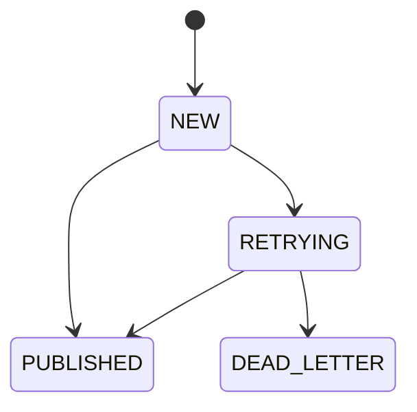
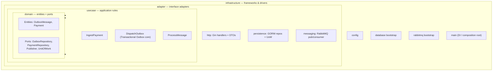

# Transaction Outbox (Go Monorepo)

A reliable payments ingestion pipeline that accepts REST writes (`POST` / `PUT` /
`PATCH`), guarantees **no message loss**, and persists each payment **exactly
once** — implemented with the **Transactional Outbox** pattern over RabbitMQ and
Postgres.

---

## Why this exists

Publishing straight from an HTTP handler to a message broker is **lossy**: if the
broker is unreachable the moment the request arrives, the message is gone after
the client already received a `2xx`. The Transactional Outbox pattern fixes this:
the request is first committed to the database in the *same transaction* that
acknowledges the client, and a separate relay reliably forwards it to the broker.

| Concern | How it's solved |
|---|---|
| **No message loss** | Request is durably written to a Postgres `outbox_messages` table before the client gets `201`. `DispatchOutbox` publishes to RabbitMQ with **publisher confirms**. |
| **Idempotency / no duplicates** | Deterministic dedup key (`sha256(method + provider.name:eventId + optional Idempotency-Key)`) is the outbox `UNIQUE` constraint **and** the RabbitMQ `MessageId` — a webhook redelivery carries the same `eventId`, the natural dedup boundary. The consumer also dedupes on `payments.source_message_id` (UNIQUE) — a redelivered message is a safe no-op insert. |
| **Poison messages** | Dead-letter exchange/queue (`payments.dlx` → `payments.dlq`) after N redeliveries. |
| **Horizontal scaling** | `DispatchOutbox` polls with `FOR UPDATE SKIP LOCKED`; consumer uses prefetch + manual ack. |

---

## Tech stack

| Layer | Technology | Version |
|---|---|---|
| Language | Go | **1.26.4** |
| HTTP framework | Gin (`github.com/gin-gonic/gin`) | latest |
| ORM | GORM (`gorm.io/gorm` + `gorm.io/driver/postgres`) | latest |
| Message broker | RabbitMQ (`rabbitmq:4.3-management`, **quorum queues**) | **4.3.2** |
| Database | PostgreSQL (`timescale/timescaledb:latest-pg18` — TimescaleDB, Phase 4 Track 2) | **18** |
| AMQP client | `github.com/rabbitmq/amqp091-go` | latest |
| Config | `github.com/kelseyhightower/envconfig` | latest |
| Local orchestration | Podman Compose | — |

> **Go is not installed on the host.** All `go build`/`test`/`lint` commands run
> inside containers via `make` targets — see [Build / run commands](#build--run-commands-local-dev).

---

## Architecture

Two binaries, but **N consumer-worker instances** — one per payment method
(Phase 3), each bound to exactly one RabbitMQ queue via `PAYMENT_QUEUE`, so
KEDA can scale a method's consumers independently of the others. The
**`DispatchOutbox`** use case runs as a background goroutine inside
`ingestion-api` (not a third process), so the API both serves HTTP and
dispatches the outbox — handling the full Transactional Outbox responsibility.
The API **never writes to the `payments` table** — only `consumer-worker` does.

```mermaid
flowchart LR
    Client([Client])

    subgraph API["ingestion-api (process 1)"]
        direction TB
        H[Gin HTTP handler]
        R[DispatchOutbox goroutine<br/>poll · publish · mark]
        H -. "in-process" .- R
    end

    subgraph DB[(PostgreSQL 18 / TimescaleDB)]
        OBX[[outbox_messages]]
        PAY[[payments]]
    end

    subgraph MQ["RabbitMQ 4.3 (quorum, one queue + DLQ per method)"]
        EX{{payments.exchange<br/>topic, routing key = payment.&lt;method&gt;}}
        QPIX[[payments.pix.queue]]
        QBOL[[payments.boleto.queue]]
        QTRF[[payments.transfer.queue]]
        QCC[[payments.cartao_credito.queue]]
        QCD[[payments.cartao_debito.queue]]
        DLX{{payments.dlx}}
        EX --> QPIX & QBOL & QTRF & QCC & QCD
        QPIX -. "max deliveries" .-> DLX
        QBOL -. "max deliveries" .-> DLX
        QTRF -. "max deliveries" .-> DLX
        QCC -. "max deliveries" .-> DLX
        QCD -. "max deliveries" .-> DLX
    end

    subgraph WORK["consumer-worker — one instance per method (PAYMENT_QUEUE)"]
        CPIX[Consumer: pix]
        CBOL[Consumer: boleto]
        CTRF[Consumer: transfer]
        CCC[Consumer: cartao_credito]
        CCD[Consumer: cartao_debito]
    end

    Client -- "POST/PUT/PATCH /api/v1/payments" --> H
    H -- "tx: INSERT (idempotency_key UNIQUE, status=NEW, payment_method)" --> OBX
    H -- "201 Created" --> Client
    R -- "SELECT status IN (NEW, RETRYING) FOR UPDATE SKIP LOCKED" --> OBX
    R -- "publish (confirm, persistent, routing key = payment.&lt;method&gt;)" --> EX
    R -- "mark PUBLISHED" --> OBX
    QPIX --> CPIX
    QBOL --> CBOL
    QTRF --> CTRF
    QCC --> CCC
    QCD --> CCD
    CPIX & CBOL & CTRF & CCC & CCD -- "INSERT ... ON CONFLICT (source_message_id) DO NOTHING" --> PAY
```

> This diagram is the core Phase 1–3 dataflow. In cloud, `Client` actually
> hits an ALB + AWS WAF in front of `ingestion-api` (not shown — see
> [Edge protection](#edge-protection-rate-limiting--waf)), both services
> deploy via Argo Rollouts canary steps (see [Canary deploys](#canary-deploys)),
> and Prometheus/Grafana observe every box above (see
> [Observability](#observability-prometheus--grafana)).

### End-to-end flow

```mermaid
sequenceDiagram
    autonumber
    participant Cl as Client
    participant API as ingestion-api (HTTP)
    participant PG as Postgres
    participant RL as DispatchOutbox goroutine
    participant MQ as RabbitMQ
    participant CW as consumer-worker

    Cl->>API: POST /api/v1/payments (+ optional Idempotency-Key)
    API->>API: paymentId = uuid.NewV7()
    API->>API: key = sha256(method + provider.name:eventId + key?)
    API->>PG: BEGIN; INSERT outbox (status=NEW) ON CONFLICT DO NOTHING; COMMIT
    API-->>Cl: 201 Created { paymentId, idempotencyKey, status }
    loop DispatchOutbox poll (Transactional Outbox)
        RL->>PG: SELECT status IN (NEW, RETRYING) FOR UPDATE SKIP LOCKED
        RL->>MQ: publish (persistent, MessageId=key, confirms)
        MQ-->>RL: confirm ACK
        RL->>PG: UPDATE status = PUBLISHED
    end
    MQ->>CW: deliver (manual ack)
    CW->>PG: INSERT payments ON CONFLICT (source_message_id) DO NOTHING
    CW->>MQ: ack
```

### Outbox status state machine



`RETRYING` increments `retry_count` on every failed publish attempt; once
`retry_count` reaches `MAX_RETRIES` the row moves to `DEAD_LETTER` and
`DispatchOutbox` stops retrying it.

---

## Clean Architecture

The codebase follows Clean Architecture. The **dependency rule** points inward:
outer layers depend on inner layers, never the reverse. The `domain` layer is pure
Go — it has **no imports** of Gin, GORM, or RabbitMQ. Those frameworks live in the
outer layers and are injected at the composition root (`cmd/*/main.go`).



| Layer | Responsibility | May import |
|---|---|---|
| `domain` | Entities + port interfaces | nothing external |
| `usecase` | Application flows (`IngestPayment`, `DispatchOutbox`, `ProcessMessage`) | `domain` only |
| `adapter` | Gin handlers, GORM repositories, RabbitMQ pub/consumer | `domain`, `usecase` |
| `infrastructure` | Config, DB/MQ bootstrap, `main` wiring (DI) | all of the above |

> GORM-tagged structs live **only** in `adapter/persistence`. Domain entities are
> plain structs; repositories map between the two so inner layers stay framework-free.

`internal/observability` is a small dependency-free leaf (same idea as
`internal/domain/pii`): two helpers — `Int64Counter`/`Int64Gauge` — that wrap
OTel metric-instrument construction and log the (spec-guaranteed-non-fatal)
creation error once, so `usecase/outbox`, `usecase/consume`,
`adapter/messaging`, and `adapter/http/ratelimit` don't each repeat the same
"log the error, then nil-check every call site" boilerplate. Any layer may
import it, the same way any layer may import `domain/pii`.

---

## Components

- **`ingestion-api`** — Gin HTTP server exposing `POST/PUT/PATCH /api/v1/payments`
  and `/healthz`. Pre-generates the Payment UUID, computes the idempotency key from
  the business fields, writes **only** to the outbox table inside a transaction
  (status `NEW`), returns `201 Created`. Also hosts the **`DispatchOutbox`
  goroutine** — the Transactional Outbox core: polls `NEW`/`RETRYING` rows
  (deduped via `FOR UPDATE SKIP LOCKED`), publishes to RabbitMQ with publisher
  confirms, marks rows `PUBLISHED` (or `RETRYING`/`DEAD_LETTER` on failure), and
  prunes old published rows.
- **`consumer-worker`** — RabbitMQ consumer with prefetch + manual ack. The
  **only writer** of the `payments` table — dedupes via the
  `payments.source_message_id` `UNIQUE` constraint (`ON CONFLICT DO NOTHING`), so
  a redelivered message is a safe no-op. No separate inbox table.
- **PostgreSQL** — stores `outbox_messages` and `payments`.
- **RabbitMQ** — durable topic exchange (`payments.exchange`) + quorum queue
  (`payments.queue`) + dead-letter queue (`payments.dlq`).
- **`outbox-admin`** — a one-shot maintenance CLI, **not** a third
  long-running service (`DispatchOutbox` stays a goroutine inside
  `ingestion-api`). Two subcommands, both driven by `make`:
  `replay-dead --method PIX --limit 100` resets `DEAD_LETTER` outbox rows
  back to `NEW` so the existing dispatch loop republishes them;
  `drain-dlq --method PIX` moves messages sitting in `payments.pix.dlq` back
  onto `payments.pix.queue`. Shares `DATABASE_URL`/`RABBITMQ_URL` with the two
  services but never binds an HTTP port. See `make replay-dead` /
  `make drain-dlq` and [`cmd/outbox-admin/main.go`](cmd/outbox-admin/main.go).

---

## Payment wire format

The request body mirrors a payment-provider webhook (e.g. **Mercado Pago PIX**):
a generic envelope plus a method-specific sibling object named after
`payment.method` lowercased:

```json
{
  "eventId": "evt_123456",
  "provider": {
    "name": "MERCADO_PAGO",
    "providerPaymentId": "987654321"
  },
  "payment": {
    "paymentId": "pay_123",
    "amount": 100.50,
    "currency": "BRL",
    "method": "PIX",
    "payerId": "018f7f9e-6e8b-7c3a-8f2a-000000000001",
    "recipientId": "018f7f9e-6e8b-7c3a-8f2a-000000000002"
  },
  "pix": {
    "endToEndId": "E123456789ABCDEF",
    "txid": "ORDER123"
  },
  "occurredAt": "2026-06-19T18:30:00Z"
}
```

- `payerId`/`recipientId` are **optional** — a provider webhook describes a
  payment the provider already tracked, not necessarily two parties known to
  our own ledger.
- `amount` is a decimal float in currency units on the wire; the handler
  converts it to `int64` minor units (cents) immediately — domain and
  persistence code never see a float.
- The method-specific object (here `"pix"`) is extracted generically by
  lowercasing `payment.method` and looking up that key in the raw JSON body,
  then stored opaquely as `MethodDetails` (JSONB). Adding a new method
  (`CARD`, `BOLETO`, ...) needs no DTO change.
- `paymentId` (the provider's own reference, e.g. `"pay_123"`) is stored as
  `ExternalPaymentID`, distinct from our server-generated `Payment.ID` (UUID
  v7) and from `provider.providerPaymentId`.

### Supported payment methods

| Method | Sibling object | Required fields |
|---|---|---|
| `PIX` | `pix` | `endToEndId`, `txid` |
| `BOLETO` | `boleto` | `barcode`, `dueDate`, `payerDocument` |
| `TRANSFER` | *(none — internal)* | `payment.payerId` and `payment.recipientId` |
| `CARTAO_CREDITO` | `cartao_credito` | `cardNumber`, `cardType` (`CREDIT`), `cardIssuer` |
| `CARTAO_DEBITO` | `cartao_debito` | `cardNumber`, `cardType` (`DEBIT`), `cardIssuer` |

`TRANSFER` is the one method **we** originate rather than a provider — there's
no external webhook driving it, so instead of a sibling details object it
requires both parties (`payerId`, `recipientId`) to be present.

The two card methods carry a PAN (`cardNumber`) — **PII that's masked to its
last 4 digits at the HTTP boundary** (`internal/adapter/http/card.go`,
`maskPAN`) before the request ever reaches the outbox, RabbitMQ, or
Postgres. `cardType` must match the method (`CARTAO_CREDITO` ⇒ `CREDIT`,
`CARTAO_DEBITO` ⇒ `DEBIT`) and `cardIssuer` must be one of `VISA` /
`MASTERCARD` / `AMERICAN`; a mismatch is a `400`.

**A `method` outside this table is rejected with `400`** — Phase 3 routes
each method to its own dedicated RabbitMQ queue (see the diagram above), so
an unrecognized method has no bound queue and would be silently dropped by
the broker if accepted. See `ValidateMethod` in
[`internal/adapter/http/dto.go`](internal/adapter/http/dto.go) and `Methods`
in [`internal/infrastructure/rabbitmq/rabbitmq.go`](internal/infrastructure/rabbitmq/rabbitmq.go)
to add a 6th method.

```bash
make seed-pix       # PIX sample
make seed-boleto    # BOLETO sample
make seed-transfer  # TRANSFER sample (payerId -> recipientId)
make seed-card      # CARTAO_CREDITO sample (cardNumber masked to last-4 by the handler)
```

## Idempotency / dedup key

```
key = sha256( http_method + sha256(provider.name:eventId) + Idempotency-Key? )
```

- The hash is computed from the **provider's own event identity**
  (`provider.name` + `eventId`) — never from the server-generated Payment
  UUID, or every request would be unique and dedup would never trigger. A
  webhook redelivery carries the same `eventId`, making it the natural dedup
  boundary.
- **No `Idempotency-Key` header** → redeliveries of the same `eventId`
  collapse into a single outbox row.
- **With `Idempotency-Key` header** → the header is folded into the hash, so
  two genuinely distinct requests carrying different keys are never wrongly
  merged.

The same key is the outbox `UNIQUE` constraint and the RabbitMQ `MessageId`. The
consumer's dedup is independent — as of Phase 4 Track 2, it's a **two-column**
`UNIQUE(source_message_id, occurred_at)` constraint on each per-method
hypertable (was a single-column `UNIQUE(source_message_id)` on the old plain
`payments` table). See [TimescaleDB](#timescaledb-per-method-hypertables)
below for why the dedup key gained a column and why redelivery safety still
holds.

A dedup hit on the ingest side is exported as `ingestion.duplicate_total`
(by `payment.method`) — visible on the ingestion-api dashboard's "Ingest
duplicate (idempotency dedup) rate" panel — in addition to the `dedup_hit`
span attribute on `ingest.payment`. The consumer-side equivalent is the
`outcome="duplicate"` taxonomy covered next.

### Consumer outcome taxonomy

A duplicate delivery hitting that `UNIQUE` constraint is **not an error** —
`PaymentRepository.Save` ([`payment_repo.go`](internal/adapter/persistence/payment_repo.go))
reports it via a `created bool` return (mirroring how `OutboxRepository.Enqueue`
already tells `IngestPayment` an `"accepted"` apart from a `"duplicate"`), so
`ProcessMessage.Execute` ([`process.go`](internal/usecase/consume/process.go))
and `AMQPConsumer.handle` ([`consumer.go`](internal/adapter/messaging/consumer.go))
can tell it apart from both a fresh save and a genuine processing error,
instead of lumping all three under one generic `ack`/error split. Every code
path tags the **same `outcome` attribute name** — on the span, on the
`consumer.messages_processed_total` metric, and (for the non-`ack`/`saved`
cases) on a structured `slog` field — so all three OTel signals (traces,
metrics, logs) agree on one vocabulary you can filter/group by in Jaeger,
Grafana, or Loki alike:

| `outcome` | Meaning | Retried? | Reaches DLQ? |
|---|---|---|---|
| `saved` / `ack` | Fresh row persisted | — | — |
| `duplicate` | `(source_message_id, occurred_at)` already existed — a safe redelivery no-op | No — Ack'd immediately | No |
| `retry_scheduled` | Transient processing error, requeued via the per-method `*.retry` queue with backoff | Yes, up to `MAX_DELIVERIES` | Eventually, if retries exhaust |
| `poison_dlq` | `MAX_DELIVERIES` exhausted | No — terminal | Yes |
| `unknown_schema_version` | `schemaVersion` newer/unrecognized — structurally can never succeed | No — DLQ'd on the **first** attempt | Yes |

`duplicate` and `unknown_schema_version` never loop: both are decided by a
condition that's independent of delivery count (a `DO NOTHING` conflict, or a
version string that will never change on redelivery), so neither one ever
enters the retry machinery in the first place — a duplicate is structurally
incapable of reaching the DLQ.

---

## TimescaleDB: per-method hypertables

`payments` is now **five TimescaleDB hypertables** — `payments_pix`,
`payments_boleto`, `payments_transfer`, `payments_cartao_credito`,
`payments_cartao_debito` — each chunked at a **1-day interval** on
`occurred_at`, plus a `payments` **`VIEW` = `UNION ALL`** of all five so
ad-hoc "all payments" queries (and the Grafana infra dashboard's SQL) keep
working against one name. Writes always target the concrete per-method
table ([`internal/adapter/persistence/payment_repo.go`](internal/adapter/persistence/payment_repo.go));
the migration itself is raw, idempotent SQL run at `ingestion-api` startup
([`MigrateTimescale`](internal/adapter/persistence/migrate.go)) — GORM's
`AutoMigrate` can't create extensions, hypertables, or partition-aware
indexes.

**Why `occurred_at`, not `created_at`, is the partition column — the
load-bearing decision here:** TimescaleDB requires every `UNIQUE` index on a
hypertable to include the partitioning column. Partitioning by `created_at`
(insert time) would force the dedup key to be
`(source_message_id, created_at)` — but a RabbitMQ redelivery of the same
message gets a *new* `created_at` on each insert attempt, so that tuple would
differ between the original and the redelivery, `ON CONFLICT DO NOTHING`
would never fire, and the consumer would silently double-insert. `occurred_at`
comes from the wire payload and is identical across redeliveries, so
`(source_message_id, occurred_at)` is stable and dedup still holds — verified
by [`TestTimescale_RedeliveryDedupsOnSourceMessageIDAndOccurredAt`](tests/integration/timescale_test.go).

Per-method tables over a single multi-dimensional hypertable: TimescaleDB's
hash-space partitioning doesn't map cleanly to 5 named methods, and a
hypertable can't be a partition of a native `LIST`-partitioned parent — see
`.claude/plan-phase4.md` Track 2 for the full comparison.

```sql
\d+ payments_pix              -- confirms it's a hypertable, 1-day chunks
SELECT * FROM payments;       -- the UNION ALL view, reads across all 5
SELECT show_chunks('payments_pix');
```

**Cloud:** RDS's TimescaleDB extension support is the one open question
captured in `.claude/plan-phase4.md` — if the target RDS engine version
doesn't offer it, the fallback is self-managed TimescaleDB on EKS or
Timescale Cloud. Local dev is unaffected either way.

---

## Project structure

```
TransactionOutboxGo/
├── .claude/plan.md            # full implementation plan
├── CLAUDE.md                  # guidance for Claude Code in this repo
├── cmd/
│   ├── ingestion-api/         # HTTP server + DispatchOutbox goroutine (composition root)
│   ├── consumer-worker/       # RabbitMQ consumer (composition root)
│   └── outbox-admin/          # one-shot maintenance CLI: replay-dead / drain-dlq (not a 3rd service)
├── internal/
│   ├── domain/                # entities (OutboxMessage, Payment) + ports + SchemaVersion/ParseOptionalUUID/Backoff (no framework imports)
│   ├── observability/         # tiny OTel metric-instrument helpers shared by usecase + adapter (no framework imports beyond the otel API)
│   ├── usecase/                # ingest (IngestPayment) / outbox (DispatchOutbox) / consume (ProcessMessage)
│   ├── adapter/                # http · persistence · messaging
│   └── infrastructure/         # config · database · rabbitmq · telemetry · logging
├── tests/integration/          # TestContainers suite (Postgres + RabbitMQ) — see Testing below
├── docker-compose.yml
├── Dockerfile
└── Makefile
```

---

## Environment variables

Both binaries read config via [`internal/infrastructure/config`](internal/infrastructure/config/config.go)
(`envconfig`). `DATABASE_URL` and `RABBITMQ_URL` are the only two marked
`required` — everything else has a default. See [`.env.example`](.env.example)
for local-dev values and [`docker-compose.yml`](docker-compose.yml) for how
each service's env block is actually wired.

### Shared (both `ingestion-api` and `consumer-worker`)

| Variable | Default | Meaning |
|---|---|---|
| `DATABASE_URL` | *(required)* | Postgres DSN |
| `RABBITMQ_URL` | *(required)* | AMQP connection string |
| `OTEL_SERVICE_NAME` | `transaction-outbox-go` | OTel resource service name — each service/per-method consumer overrides this to its own name (e.g. `consumer-worker-pix`) |
| `OTEL_EXPORTER_OTLP_ENDPOINT` | `localhost:4318` | OTLP/HTTP collector endpoint (Jaeger in local dev) |
| `METRICS_PORT` | `9090` | Prometheus `/metrics` port — each per-method consumer-worker overrides this to its own fixed port (9091–9095, see `docker-compose.yml`) |

### `ingestion-api` only

| Variable | Default | Meaning |
|---|---|---|
| `HTTP_PORT` | `8080` | HTTP listen port |
| `SWAGGER_ENABLED` | `false` | Serve swagger UI at `/swagger/index.html` (local dev defaults this to `true`; production leaves it `false`) |
| `OUTBOX_DISPATCH_INTERVAL_MS` | `500` | Poll interval for the `DispatchOutbox` goroutine |
| `OUTBOX_DISPATCH_BATCH_SIZE` | `50` | Rows fetched per dispatch poll |
| `OUTBOX_MAX_RETRIES` | `5` | Publish attempts before an outbox row is marked `DEAD_LETTER` |
| `OUTBOX_PRUNE_AFTER_HOURS` | `48` | Hours after which a `PUBLISHED` row is eligible for pruning |
| `RATE_LIMIT_ENABLED` | `false` locally, `true` in cloud Helm values | Leaky-bucket IP rate limiter (see [Edge protection](#edge-protection-rate-limiting--waf) below). Off by default in `docker-compose.yml`/`.env.example` so k6 load tests and seed scripts don't throttle themselves |
| `RATE_LIMIT_RATE` | `50` | Leak rate, requests/second per client IP |
| `RATE_LIMIT_BURST` | `100` | Bucket capacity (requests admitted immediately before throttling kicks in) |
| `TRUSTED_PROXIES` | *(empty)* | Comma-separated CIDRs Gin trusts for `X-Forwarded-For` when resolving `c.ClientIP()`. Empty locally (no proxy in front, uses `RemoteAddr` directly); set to the VPC/private-subnet CIDRs in cloud, where the ALB sits in front and injects XFF |

### `consumer-worker` only

| Variable | Default | Meaning |
|---|---|---|
| `PAYMENT_QUEUE` | *(required — no default)* | The single RabbitMQ queue this instance binds to and drains, e.g. `payments.pix.queue`. Must be one of `rmq.Methods`' queue names ([`internal/infrastructure/rabbitmq`](internal/infrastructure/rabbitmq/rabbitmq.go)) — every other env var here is shared with `ingestion-api`'s `Config` struct, but this one is consumer-worker-only and the binary fails fast at startup if it's empty or unrecognized (no implicit "consume everything" mode) |
| `PREFETCH_COUNT` | `10` | AMQP consumer prefetch count |
| `MAX_DELIVERIES` | `5` | Redelivery attempts before a message is routed to its method's DLQ |

---

## Build / run commands (local dev)

Go is **not installed on the host** — everything runs inside containers via
Podman.

```bash
# Build, test, lint — all run inside golang:1.26-alpine / golangci-lint via Podman
make build    # go build ./...
make test     # go test -race ./...
make tidy     # go mod tidy
make lint     # golangci-lint run ./...

# Podman Compose — starts Postgres + RabbitMQ + both services
make up       # podman compose -f docker-compose.yml up --build -d
make logs     # tail logs from all services
make down     # podman compose -f docker-compose.yml down -v
make seed     # curl a sample POST to the ingestion-api
```

### Endpoints once `make up` is healthy

| Service | URL |
|---|---|
| Ingestion API | http://localhost:8080 |
| API health | http://localhost:8080/healthz |
| RabbitMQ management UI | http://localhost:15672 (user/pass from `.env`) |
| Postgres | `localhost:5432` |

### Send a request

```bash
curl -i -X POST http://localhost:8080/api/v1/payments \
  -H "Content-Type: application/json" \
  -H "Idempotency-Key: order-123" \
  -d '{"eventId":"evt_123456","provider":{"name":"MERCADO_PAGO","providerPaymentId":"987654321"},"payment":{"paymentId":"pay_123","amount":100.50,"currency":"BRL","method":"PIX"},"pix":{"endToEndId":"E123456789ABCDEF","txid":"ORDER123"},"occurredAt":"2026-06-19T18:30:00Z"}'
```

Expect `201 Created` with a `paymentId`, `idempotencyKey`, and `status: "accepted"`.

### Verifying it works

- **Persistence:** the outbox row moves `NEW → PUBLISHED`, flows through that
  method's own queue (e.g. `payments.pix.queue`, visible in the RabbitMQ UI),
  and lands as one row in `payments`.
- **Idempotency:** repeat the same `curl` → outbox response comes back
  `status: "duplicate"`; still a single `payments` row.
- **Loss resistance:** `podman compose -f docker-compose.yml stop rabbitmq`,
  send a request (still `201`, outbox row stays `NEW`), then restart RabbitMQ →
  `DispatchOutbox` drains the backlog and the consumer persists it.
- **Per-method isolation:** `make seed-card` then check the RabbitMQ UI —
  the message lands only in `payments.cartao_credito.queue`; every other
  method's queue stays at 0.

---

## Testing

Two suites, deliberately split by what they need to run:

| Suite | Command | Needs | What it covers |
|---|---|---|---|
| Unit | `make test-unit` | nothing — pure Go | `usecase`/`adapter`/`domain` logic against hand-written fakes/mocks of the `domain` ports (`OutboxRepository`, `Publisher`, `UnitOfWork`, ...) |
| Integration | `make test-integration` | Podman socket reachable from inside the test container (TestContainers) | The same code wired to **real** Postgres 17/TimescaleDB and RabbitMQ 4.3 containers — migrations, GORM repos, the AMQP publisher/consumer, `LISTEN`/`NOTIFY`, retry backoff, DLQ replay |

Both are plain `go test`, gated behind the `integration` build tag for the
second suite (`tests/integration/*_test.go` all start with
`//go:build integration`) — `go build ./...` and `make test-unit` never touch
them.

### Integration suite (TestContainers)

[`tests/integration/suite_test.go`](tests/integration/suite_test.go) spins up
**one Postgres + one RabbitMQ container pair for the whole package**
(`TestMain`), applies the real `migrations/` directory via `golang-migrate`
(no `AutoMigrate`), and wires the actual `IngestPayment` / `DispatchOutbox` /
`ProcessMessage` use-cases against them — `truncateAll` resets tables and
purges every queue between tests instead of restarting containers, so the
suite stays fast. It needs the Podman socket mounted into the test
container (`make test-integration` does this for you — see the Makefile
comment on why Ryuk is disabled for Podman) and runs in CI only when
explicitly requested (`workflow_dispatch` or a `ci:integration` PR label —
see [CI/CD](#cicd) below), since it's a safety net, not a release gate.

It exercises things a pure-mock unit test structurally can't: the
`FOR UPDATE SKIP LOCKED` dispatch query against concurrent dispatchers, the
`payments.source_message_id` `UNIQUE` constraint actually rejecting a
redelivered message, a poison message really landing in its method's DLQ
after `MAX_DELIVERIES`, `ReplayDeadLetters` resetting real rows, the
`LISTEN`/`NOTIFY` wakeup path (`internal/infrastructure/database.Listener`),
and the TimescaleDB per-method hypertable dedup key from
[TimescaleDB](#timescaledb-per-method-hypertables) above.

### Coverage

```bash
make coverage-all   # runs test-unit + test-integration, merges the two
                     # profiles (gocovmerge, fetched ad hoc — never added to
                     # go.mod), prints the combined % and writes
                     # merged-coverage.html
```

A unit-only number understates real coverage here on purpose: `adapter/persistence`,
`infrastructure/database`, and `infrastructure/rabbitmq` are thin wrappers
over GORM/pgx/amqp091 that are exercised against the **real** dependency in
the integration suite rather than mocked in a unit test, so `make coverage-all`
— not `make test-unit` alone — is the number that reflects this project's
actual line coverage. Merged, `internal/` is at **~84%**, comfortably past
the project's 80% target for `usecase`/`adapter`; the remaining gaps are
intentionally-thin infrastructure wiring (`cmd/*/main.go`'s composition
roots aren't covered by either suite — they're DI glue, asserted indirectly
by every other test exercising the objects they wire together) and the OTLP
trace-exporter path in `internal/infrastructure/telemetry` (network-bound,
not worth a live collector dependency just for this).

---

## CI/CD

Two independent GitHub Actions workflows, one per microservice —
[`ingestion-api.yml`](.github/workflows/ingestion-api.yml) and
[`consumer-worker.yml`](.github/workflows/consumer-worker.yml) — so a change
scoped to one service never triggers, gates, or redeploys the other. Both
follow: **Build → lint (golangci-lint + actionlint + helm lint) → Unit Tests
→ Upload (ECR, OIDC-authenticated) → Deploy (`pulumi up`)**, with an optional
flag-gated Integration Tests (TestContainers) job that's a safety measure
only — it never blocks Upload/Deploy. See
[`.github/workflows/README.md`](.github/workflows/README.md) for the full
gate breakdown and why two files instead of one matrixed workflow.

## Deploying to AWS

[`infra/pulumi/`](infra/pulumi/) provisions the AWS target both CI pipelines
deploy to: EKS (two node groups, one per microservice, Graviton/arm64),
ECR, RDS Postgres, Amazon MQ for RabbitMQ, and the KEDA operator — then
installs the existing [`helmcharts/transaction-outbox`](helmcharts/transaction-outbox/)
chart onto it, unmodified except for image tags, secrets, and per-service
node selectors.

**Network/security boundary:** `ingestion-api` is the *only* component
reachable from the public internet — an internet-facing **ALB** (Phase 4
Track 1 replaced the Phase 3 NLB; see [Edge protection](#edge-protection-rate-limiting--waf)
below for why). `consumer-worker` has no Kubernetes Service at all — nothing
to expose, by construction — and both RDS and Amazon MQ are
`PubliclyAccessible: false` behind a security group whose only ingress rule
sources from the EKS node security group, not the VPC CIDR or the internet.
See `.claude/plan-phase3.md`'s Track 4 "Network & Security Boundary" section
for the full rationale.

`infra/pulumi/` also installs the **AWS Load Balancer Controller** (provisions
the ALB from the chart's `Ingress`) and the **Argo Rollouts** controller
(drives the canary deploys — see [Canary deploys](#canary-deploys) below).
Both are cluster-wide infrastructure, installed before the app chart so their
CRDs/webhooks exist when the chart's `Rollout`/`Ingress` resources apply.

```bash
cd infra/pulumi
pulumi config set --secret dbPassword <...>
pulumi config set --secret rabbitmqPassword <...>
# One-time per AWS account — see albcontroller.go for why this isn't
# provisioned by Pulumi itself.
pulumi config set albControllerPolicyArn <policy-arn-from-aws-docs>
pulumi up --stack dev
```

---

## Edge protection: rate limiting + WAF

`ingestion-api` is the only publicly reachable service, so it carries two
layers of per-IP throttling — defense in depth, not redundancy:

1. **App-level leaky bucket** ([`internal/adapter/http/ratelimit`](internal/adapter/http/ratelimit/)) —
   an in-process, per-pod meter keyed on `c.ClientIP()`. Each client IP leaks
   at `RATE_LIMIT_RATE` req/s with a burst capacity of `RATE_LIMIT_BURST`;
   once exhausted, requests get `429 Too Many Requests` with a `Retry-After`
   header. `/healthz`, `/metrics`, and `/swagger` are exempt — only
   `/api/v1/payments` is limited. This is the **only** layer present locally
   (no ALB/WAF in `docker-compose.yml`), and is **off by default** there (see
   the env var table above) so k6/seed scripts don't throttle themselves.
   - **Caveat:** with `ingestionApi.hpa` scaling `1→10` replicas and no shared
     store, the effective global limit per IP is `N × RATE_LIMIT_RATE` across
     N pods — each meters independently. A Redis-backed shared bucket would
     fix this; out of scope for now, and the `BucketStore` interface is
     written so swapping in one later is a one-file change.
2. **AWS WAF rate-based rule + managed rule groups**, attached to the ALB —
   a coarser, cluster-wide per-IP cap (blocks an IP exceeding N requests per
   5-minute window) plus `AWSManagedRulesCommonRuleSet` /
   `AWSManagedRulesKnownBadInputsRuleSet` / `AWSManagedRulesAmazonIpReputationList`.
   This sheds volumetric floods at the edge, before they ever reach a pod —
   complementary to, not a replacement for, the app-level limiter.
3. **AWS Shield Standard** — free, automatic, always-on for the ALB
   (L3/L4 DDoS mitigation). No configuration; Shield Advanced is out of scope.

**Why the front door moved from an NLB to an ALB:** an NLB is layer-4 and
strips the real client IP (`kube-proxy` SNATs to the node IP under the
default `externalTrafficPolicy`), making IP-based limiting meaningless, and
AWS WAF can't attach to an NLB at all. The ALB injects `X-Forwarded-For` with
the real client IP, and `router.SetTrustedProxies(TRUSTED_PROXIES)` makes
Gin's `c.ClientIP()` trust only that — a spoofed client-supplied XFF entry is
ignored.

## Observability: Prometheus + Grafana

`make up` (or `make observability-up` for just the app + dashboards subset)
brings up **Prometheus** (scraping every service's existing OTel
`/metrics` endpoint plus RabbitMQ's built-in `rabbitmq_prometheus` plugin and
a `postgres_exporter` sidecar) and **Grafana** at `http://localhost:3000`
(`admin`/`admin` by default — see `GRAFANA_ADMIN_USER`/`PASSWORD`), with three
dashboards auto-provisioned from committed JSON
([`observability/grafana/dashboards/`](observability/grafana/dashboards/)) —
the same files serve local Grafana and cloud Grafana, so they never drift:

- **ingestion-api** — request rate, P50/P95/P99 latency, 2xx/4xx/5xx
  breakdown, rate-limiter rejections, outbox publish rate/backlog, Go runtime
  metrics.
- **consumer-worker** — per-method throughput/outcome (`ack`/`duplicate`/
  `retry_scheduled`/`poison_dlq`/`unknown_schema_version` — see
  [Consumer outcome taxonomy](#consumer-outcome-taxonomy) below), retry
  depth, queue backlog, a `$method` template variable to isolate one payment
  method.
- **infra** — RabbitMQ per-queue depth (queues *and* DLQs, so a poison spike
  on one method is visible without touching the others), Postgres connections/
  TPS/cache-hit-ratio/deadlocks.

In cloud, Grafana is internal-only (no public Ingress) — reach it via
`kubectl port-forward svc/...grafana 3000`.

## Canary deploys

Both services roll out progressively via **Argo Rollouts**
(`helmcharts/transaction-outbox`'s `canary.enabled` — `true` in the Pulumi
cloud target, `false` locally where the controller isn't installed, falling
back to a plain `Deployment`+HPA). The two services use different step
shapes — see `.claude/plan-phase4.md` Track 4 for the full rationale:

- **ingestion-api:** lands at **0%** → a human promotes → **5%** → a human
  promotes → from there it advances **automatically every 20 minutes**
  through 20→50→100%, *unless* a background `AnalysisTemplate` (querying
  Prometheus for the canary's own 5xx rate) detects a regression, in which
  case it auto-aborts. Traffic is split at the **request** level via the
  ALB target groups (`trafficRouting.alb`) — "5%" means 5% of requests.
  - **Testing the canary on demand, even at 0% weight:** any request carrying
    the header `canary: true` is always routed to the canary pods,
    independent of the current weight — a second, static ALB listener rule
    (`ingress-canary-header.yaml`) that Argo Rollouts doesn't manage.
- **consumer-worker:** lands at **0%** → a human promotes → **5%** → after
  **1 hour** with no manual action, it jumps straight to **100%** (no 20/50
  steps — a queue consumer's blast radius is already bounded by the 1-hour
  soak). It has no Service, so "weight" here means the canary/stable **pod
  proportion**, i.e. the fraction of messages the new version processes.

Promote/abort via the `kubectl-argo-rollouts` plugin:

```bash
kubectl argo rollouts get rollout ingestion-api --watch
kubectl argo rollouts promote ingestion-api      # advance one step
kubectl argo rollouts abort ingestion-api         # roll back to stable
```

---

## License

TBD.
