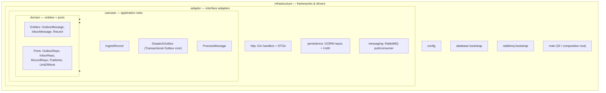

# Transaction Outbox (Go Monorepo)

A reliable ingestion pipeline that accepts REST writes (`POST` / `PUT` / `PATCH`),
guarantees **no message loss**, and persists each message **exactly once** —
implemented with the **Transactional Outbox** + **Inbox (dedup)** patterns over
RabbitMQ and Postgres.

> Status: 📝 design & documentation phase. Code is being built incrementally per
> [`.claude/plan.md`](.claude/plan.md).

---

## Why this exists

Publishing straight from an HTTP handler to a message broker is **lossy**: if the
broker is unreachable the moment the request arrives, the message is gone after
the client already received a `2xx`. The Transactional Outbox pattern fixes this:
the request is first committed to the database in the *same transaction* that
acknowledges the client, and a separate relay reliably forwards it to the broker.

| Concern | How it's solved |
|---|---|
| **No message loss** | Request is durably written to a Postgres `outbox` table before the client gets `202`. `DispatchOutbox` publishes to RabbitMQ with **publisher confirms**. |
| **Idempotency / no duplicates** | Deterministic dedup key (`sha256(method + payload + optional Idempotency-Key)`) used as a unique constraint at the outbox **and** as the consumer's `inbox` primary key. |
| **Poison messages** | Dead-letter exchange/queue (`outbox.dlx` → `outbox.dlq`) after N redeliveries. |
| **Horizontal scaling** | `DispatchOutbox` polls with `FOR UPDATE SKIP LOCKED`; consumer uses prefetch + manual ack. |

---

## Tech stack

| Layer | Technology | Version |
|---|---|---|
| Language | Go | **1.26.4** |
| HTTP framework | Gin (`github.com/gin-gonic/gin`) | latest |
| ORM | GORM (`gorm.io/gorm` + `gorm.io/driver/postgres`) | latest |
| Message broker | RabbitMQ (`rabbitmq:4.3-management`, **quorum queues**) | **4.3.2** |
| Database | PostgreSQL | **17** |
| AMQP client | `github.com/rabbitmq/amqp091-go` | latest |
| Config | `github.com/kelseyhightower/envconfig` | latest |
| Local orchestration | Docker Compose | — |

---

## Architecture

Two binaries. The **`DispatchOutbox`** use case runs as a background goroutine
inside `ingestion-api` (not a third process), so the API both serves HTTP and
dispatches the outbox — handling the full Transactional Outbox responsibility.

```mermaid
flowchart LR
    Client([Client])

    subgraph API["ingestion-api (process 1)"]
        direction TB
        H[Gin HTTP handler]
        R[DispatchOutbox goroutine<br/>poll · dedup · publish]
        H -. "in-process" .- R
    end

    subgraph DB[(PostgreSQL 17)]
        OBX[[outbox_messages]]
        INB[[inbox_messages]]
        REC[[records]]
    end

    subgraph MQ["RabbitMQ 4.3 (quorum)"]
        EX{{outbox.exchange}}
        Q[[outbox.queue]]
        DLQ[[outbox.dlq]]
        EX --> Q
        Q -. "redelivery limit" .-> DLQ
    end

    subgraph WORK["consumer-worker (process 2)"]
        C[Consumer<br/>manual ack + prefetch]
    end

    Client -- "POST/PUT/PATCH" --> H
    H -- "tx: INSERT (idempotency_key UNIQUE)" --> OBX
    H -- "202 Accepted" --> Client
    R -- "SELECT ... FOR UPDATE SKIP LOCKED" --> OBX
    R -- "publish (confirm, persistent)" --> EX
    R -- "mark published" --> OBX
    Q -- "deliver" --> C
    C -- "tx: dedup check + persist + mark processed" --> INB
    C -- "same tx: INSERT business row" --> REC
```

### End-to-end flow

```mermaid
sequenceDiagram
    autonumber
    participant Cl as Client
    participant API as ingestion-api (HTTP)
    participant PG as Postgres
    participant RL as DispatchOutbox goroutine
    participant MQ as RabbitMQ
    participant CW as consumer-worker

    Cl->>API: POST /api/v1/records (+ optional Idempotency-Key)
    API->>API: key = sha256(method + payload + key?)
    API->>PG: BEGIN; INSERT outbox ON CONFLICT DO NOTHING; COMMIT
    API-->>Cl: 202 Accepted { message_id }
    loop DispatchOutbox poll (Transactional Outbox)
        RL->>PG: SELECT pending FOR UPDATE SKIP LOCKED
        RL->>MQ: publish (persistent, MessageId=key, confirms)
        MQ-->>RL: confirm ACK
        RL->>PG: UPDATE status = published
    end
    MQ->>CW: deliver (manual ack)
    CW->>PG: BEGIN
    alt message_id already in inbox
        CW->>PG: COMMIT (no-op)
        CW->>MQ: ack (duplicate ignored)
    else new message
        CW->>PG: INSERT record + INSERT inbox; COMMIT
        CW->>MQ: ack
    end
```

---

## Clean Architecture

The codebase follows Clean Architecture. The **dependency rule** points inward:
outer layers depend on inner layers, never the reverse. The `domain` layer is pure
Go — it has **no imports** of Gin, GORM, or RabbitMQ. Those frameworks live in the
outer layers and are injected at the composition root (`cmd/*/main.go`).



| Layer | Responsibility | May import |
|---|---|---|
| `domain` | Entities + port interfaces | nothing external |
| `usecase` | Application flows (`IngestRecord`, `DispatchOutbox`, `ProcessMessage`) | `domain` only |
| `adapter` | Gin handlers, GORM repositories, RabbitMQ pub/consumer | `domain`, `usecase` |
| `infrastructure` | Config, DB/MQ bootstrap, `main` wiring (DI) | all of the above |

> GORM-tagged structs live **only** in `adapter/persistence`. Domain entities are
> plain structs; repositories map between the two so inner layers stay framework-free.

---

## Components

- **`ingestion-api`** — Gin HTTP server exposing `POST/PUT/PATCH /api/v1/records`
  and `/healthz`. Computes the idempotency key, writes the request to the outbox
  table inside a transaction, returns `202 Accepted`. Also hosts the
  **`DispatchOutbox` goroutine** — the Transactional Outbox core: polls pending
  outbox rows (deduped via `FOR UPDATE SKIP LOCKED`), publishes to RabbitMQ with
  publisher confirms, marks rows `published`, and prunes old rows.
- **`consumer-worker`** — RabbitMQ consumer with prefetch + manual ack. Dedupes
  via the `inbox_messages` table, then persists the business `record` and the
  inbox row in a single transaction. Poison messages route to the DLQ.
- **PostgreSQL** — stores `outbox_messages`, `inbox_messages`, and `records`.
- **RabbitMQ** — durable topic exchange + quorum queue + dead-letter queue.

---

## Idempotency / dedup key

```
key = sha256( http_method + payload_hash + Idempotency-Key? )
```

- **No `Idempotency-Key` header** → `sha256(method + payload)`: byte-identical
  retries collapse into a single message.
- **With `Idempotency-Key` header** → the header is folded into the hash, so two
  genuinely distinct requests carrying different keys are never wrongly merged.

The same key is the outbox `UNIQUE` constraint, the RabbitMQ `MessageId`, and the
consumer's `inbox` primary key — making dedup consistent across the whole pipeline.

---

## Project structure

```
TransactionOutboxGo/
├── .claude/plan.md            # full implementation plan
├── CLAUDE.md                  # guidance for Claude Code in this repo
├── cmd/
│   ├── ingestion-api/         # HTTP server + DispatchOutbox goroutine (composition root)
│   └── consumer-worker/       # RabbitMQ consumer (composition root)
├── internal/
│   ├── domain/                # entities + ports (no framework imports)
│   ├── usecase/               # ingest / outbox (DispatchOutbox) / consume
│   ├── adapter/               # http · persistence · messaging
│   └── infrastructure/        # config · database · rabbitmq
├── deployments/docker-compose.yml
├── build/Dockerfile
└── Makefile
```

---

## How to run (Docker Compose)

> Requires Docker Desktop / Docker Engine with the Compose plugin.

1. **Copy the env template** (created during scaffolding):

   ```bash
   cp .env.example .env
   ```

2. **Start everything** — Postgres, RabbitMQ, and both Go services:

   ```bash
   docker compose -f deployments/docker-compose.yml up --build
   ```

   Or, once the `Makefile` exists:

   ```bash
   make up
   ```

3. **Wait for healthchecks** to pass. Endpoints:

   | Service | URL |
   |---|---|
   | Ingestion API | http://localhost:8080 |
   | API health | http://localhost:8080/healthz |
   | RabbitMQ management UI | http://localhost:15672 (user/pass from `.env`) |
   | Postgres | `localhost:5432` |

4. **Send a request:**

   ```bash
   curl -i -X POST http://localhost:8080/api/v1/records \
     -H "Content-Type: application/json" \
     -H "Idempotency-Key: order-123" \
     -d '{"type":"order.created","amount":4200}'
   ```

   Expect `202 Accepted` with a `message_id`.

5. **Tail logs / shut down:**

   ```bash
   make logs      # or: docker compose -f deployments/docker-compose.yml logs -f
   make down      # or: docker compose -f deployments/docker-compose.yml down -v
   ```

### Verifying it works

- **Persistence:** the message moves `outbox_messages.status` `pending → published`,
  flows through `outbox.queue` (visible in the RabbitMQ UI), and lands as one row
  in `records` + `inbox_messages`.
- **Idempotency:** repeat the same `curl` → still a single `records` row.
- **Loss resistance:** `docker compose stop rabbitmq`, send a request (still
  `202`, row stays `pending`), then restart RabbitMQ → `DispatchOutbox` drains it.

---

## License

TBD.
