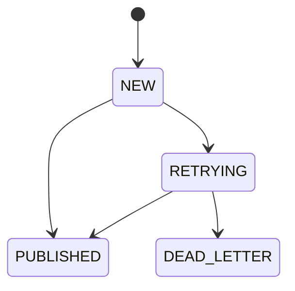
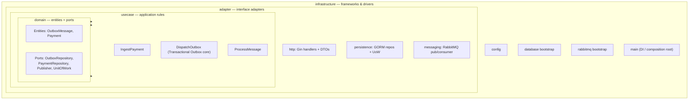

# Transaction Outbox (Go Monorepo)

A reliable payments ingestion pipeline that accepts REST writes (`POST` / `PUT` /
`PATCH`), guarantees **no message loss**, and persists each payment **exactly
once** — implemented with the **Transactional Outbox** pattern over RabbitMQ and
Postgres.

---

## Why this exists

Publishing straight from an HTTP handler to a message broker is **lossy**: if the
broker is unreachable the moment the request arrives, the message is gone after
the client already received a `2xx`. The Transactional Outbox pattern fixes this:
the request is first committed to the database in the *same transaction* that
acknowledges the client, and a separate relay reliably forwards it to the broker.

| Concern | How it's solved |
|---|---|
| **No message loss** | Request is durably written to a Postgres `outbox_messages` table before the client gets `201`. `DispatchOutbox` publishes to RabbitMQ with **publisher confirms**. |
| **Idempotency / no duplicates** | Deterministic dedup key (`sha256(method + provider.name:eventId + optional Idempotency-Key)`) is the outbox `UNIQUE` constraint **and** the RabbitMQ `MessageId` — a webhook redelivery carries the same `eventId`, the natural dedup boundary. The consumer also dedupes on `payments.source_message_id` (UNIQUE) — a redelivered message is a safe no-op insert. |
| **Poison messages** | Dead-letter exchange/queue (`payments.dlx` → `payments.dlq`) after N redeliveries. |
| **Horizontal scaling** | `DispatchOutbox` polls with `FOR UPDATE SKIP LOCKED`; consumer uses prefetch + manual ack. |

---

## Tech stack

| Layer | Technology | Version |
|---|---|---|
| Language | Go | **1.26.4** |
| HTTP framework | Gin (`github.com/gin-gonic/gin`) | latest |
| ORM | GORM (`gorm.io/gorm` + `gorm.io/driver/postgres`) | latest |
| Message broker | RabbitMQ (`rabbitmq:4.3-management`, **quorum queues**) | **4.3.2** |
| Database | PostgreSQL | **17** |
| AMQP client | `github.com/rabbitmq/amqp091-go` | latest |
| Config | `github.com/kelseyhightower/envconfig` | latest |
| Local orchestration | Podman Compose | — |

> **Go is not installed on the host.** All `go build`/`test`/`lint` commands run
> inside containers via `make` targets — see [Build / run commands](#build--run-commands-local-dev).

---

## Architecture

Two binaries. The **`DispatchOutbox`** use case runs as a background goroutine
inside `ingestion-api` (not a third process), so the API both serves HTTP and
dispatches the outbox — handling the full Transactional Outbox responsibility.
The API **never writes to the `payments` table** — only `consumer-worker` does.

```mermaid
flowchart LR
    Client([Client])

    subgraph API["ingestion-api (process 1)"]
        direction TB
        H[Gin HTTP handler]
        R[DispatchOutbox goroutine<br/>poll · publish · mark]
        H -. "in-process" .- R
    end

    subgraph DB[(PostgreSQL 17)]
        OBX[[outbox_messages]]
        PAY[[payments]]
    end

    subgraph MQ["RabbitMQ 4.3 (quorum)"]
        EX{{payments.exchange}}
        Q[[payments.queue]]
        DLQ[[payments.dlq]]
        EX --> Q
        Q -. "redelivery limit" .-> DLQ
    end

    subgraph WORK["consumer-worker (process 2)"]
        C[Consumer<br/>manual ack + prefetch]
    end

    Client -- "POST/PUT/PATCH /api/v1/payments" --> H
    H -- "tx: INSERT (idempotency_key UNIQUE, status=NEW)" --> OBX
    H -- "201 Created" --> Client
    R -- "SELECT status IN (NEW, RETRYING) FOR UPDATE SKIP LOCKED" --> OBX
    R -- "publish (confirm, persistent)" --> EX
    R -- "mark PUBLISHED" --> OBX
    Q -- "deliver" --> C
    C -- "INSERT ... ON CONFLICT (source_message_id) DO NOTHING" --> PAY
```

### End-to-end flow

```mermaid
sequenceDiagram
    autonumber
    participant Cl as Client
    participant API as ingestion-api (HTTP)
    participant PG as Postgres
    participant RL as DispatchOutbox goroutine
    participant MQ as RabbitMQ
    participant CW as consumer-worker

    Cl->>API: POST /api/v1/payments (+ optional Idempotency-Key)
    API->>API: paymentId = uuid.NewV7()
    API->>API: key = sha256(method + provider.name:eventId + key?)
    API->>PG: BEGIN; INSERT outbox (status=NEW) ON CONFLICT DO NOTHING; COMMIT
    API-->>Cl: 201 Created { paymentId, idempotencyKey, status }
    loop DispatchOutbox poll (Transactional Outbox)
        RL->>PG: SELECT status IN (NEW, RETRYING) FOR UPDATE SKIP LOCKED
        RL->>MQ: publish (persistent, MessageId=key, confirms)
        MQ-->>RL: confirm ACK
        RL->>PG: UPDATE status = PUBLISHED
    end
    MQ->>CW: deliver (manual ack)
    CW->>PG: INSERT payments ON CONFLICT (source_message_id) DO NOTHING
    CW->>MQ: ack
```

### Outbox status state machine



`RETRYING` increments `retry_count` on every failed publish attempt; once
`retry_count` reaches `MAX_RETRIES` the row moves to `DEAD_LETTER` and
`DispatchOutbox` stops retrying it.

---

## Clean Architecture

The codebase follows Clean Architecture. The **dependency rule** points inward:
outer layers depend on inner layers, never the reverse. The `domain` layer is pure
Go — it has **no imports** of Gin, GORM, or RabbitMQ. Those frameworks live in the
outer layers and are injected at the composition root (`cmd/*/main.go`).



| Layer | Responsibility | May import |
|---|---|---|
| `domain` | Entities + port interfaces | nothing external |
| `usecase` | Application flows (`IngestPayment`, `DispatchOutbox`, `ProcessMessage`) | `domain` only |
| `adapter` | Gin handlers, GORM repositories, RabbitMQ pub/consumer | `domain`, `usecase` |
| `infrastructure` | Config, DB/MQ bootstrap, `main` wiring (DI) | all of the above |

> GORM-tagged structs live **only** in `adapter/persistence`. Domain entities are
> plain structs; repositories map between the two so inner layers stay framework-free.

---

## Components

- **`ingestion-api`** — Gin HTTP server exposing `POST/PUT/PATCH /api/v1/payments`
  and `/healthz`. Pre-generates the Payment UUID, computes the idempotency key from
  the business fields, writes **only** to the outbox table inside a transaction
  (status `NEW`), returns `201 Created`. Also hosts the **`DispatchOutbox`
  goroutine** — the Transactional Outbox core: polls `NEW`/`RETRYING` rows
  (deduped via `FOR UPDATE SKIP LOCKED`), publishes to RabbitMQ with publisher
  confirms, marks rows `PUBLISHED` (or `RETRYING`/`DEAD_LETTER` on failure), and
  prunes old published rows.
- **`consumer-worker`** — RabbitMQ consumer with prefetch + manual ack. The
  **only writer** of the `payments` table — dedupes via the
  `payments.source_message_id` `UNIQUE` constraint (`ON CONFLICT DO NOTHING`), so
  a redelivered message is a safe no-op. No separate inbox table.
- **PostgreSQL** — stores `outbox_messages` and `payments`.
- **RabbitMQ** — durable topic exchange (`payments.exchange`) + quorum queue
  (`payments.queue`) + dead-letter queue (`payments.dlq`).

---

## Payment wire format

The request body mirrors a payment-provider webhook (e.g. **Mercado Pago PIX**):
a generic envelope plus a method-specific sibling object named after
`payment.method` lowercased:

```json
{
  "eventId": "evt_123456",
  "provider": {
    "name": "MERCADO_PAGO",
    "providerPaymentId": "987654321"
  },
  "payment": {
    "paymentId": "pay_123",
    "amount": 100.50,
    "currency": "BRL",
    "method": "PIX",
    "payerId": "018f7f9e-6e8b-7c3a-8f2a-000000000001",
    "recipientId": "018f7f9e-6e8b-7c3a-8f2a-000000000002"
  },
  "pix": {
    "endToEndId": "E123456789ABCDEF",
    "txid": "ORDER123"
  },
  "occurredAt": "2026-06-19T18:30:00Z"
}
```

- `payerId`/`recipientId` are **optional** — a provider webhook describes a
  payment the provider already tracked, not necessarily two parties known to
  our own ledger.
- `amount` is a decimal float in currency units on the wire; the handler
  converts it to `int64` minor units (cents) immediately — domain and
  persistence code never see a float.
- The method-specific object (here `"pix"`) is extracted generically by
  lowercasing `payment.method` and looking up that key in the raw JSON body,
  then stored opaquely as `MethodDetails` (JSONB). Adding a new method
  (`CARD`, `BOLETO`, ...) needs no DTO change.
- `paymentId` (the provider's own reference, e.g. `"pay_123"`) is stored as
  `ExternalPaymentID`, distinct from our server-generated `Payment.ID` (UUID
  v7) and from `provider.providerPaymentId`.

### Supported payment methods

| Method | Sibling object | Required fields |
|---|---|---|
| `PIX` | `pix` | `endToEndId`, `txid` |
| `BOLETO` | `boleto` | `barcode`, `dueDate`, `payerDocument` |
| `TRANSFER` | *(none — internal)* | `payment.payerId` and `payment.recipientId` |

`TRANSFER` is the one method **we** originate rather than a provider — there's
no external webhook driving it, so instead of a sibling details object it
requires both parties (`payerId`, `recipientId`) to be present. Any other
`method` value is accepted without first-class validation (the polymorphic
`MethodDetails` design tolerates unknown methods); see `ValidateMethod` in
[`internal/adapter/http/dto.go`](internal/adapter/http/dto.go) to add
validation for a new one.

```bash
make seed-pix       # PIX sample
make seed-boleto    # BOLETO sample
make seed-transfer  # TRANSFER sample (payerId -> recipientId)
```

## Idempotency / dedup key

```
key = sha256( http_method + sha256(provider.name:eventId) + Idempotency-Key? )
```

- The hash is computed from the **provider's own event identity**
  (`provider.name` + `eventId`) — never from the server-generated Payment
  UUID, or every request would be unique and dedup would never trigger. A
  webhook redelivery carries the same `eventId`, making it the natural dedup
  boundary.
- **No `Idempotency-Key` header** → redeliveries of the same `eventId`
  collapse into a single outbox row.
- **With `Idempotency-Key` header** → the header is folded into the hash, so
  two genuinely distinct requests carrying different keys are never wrongly
  merged.

The same key is the outbox `UNIQUE` constraint and the RabbitMQ `MessageId`. The
consumer's dedup is independent: the `payments.source_message_id` `UNIQUE`
constraint absorbs redelivered messages.

---

## Project structure

```
TransactionOutboxGo/
├── .claude/plan.md            # full implementation plan
├── CLAUDE.md                  # guidance for Claude Code in this repo
├── cmd/
│   ├── ingestion-api/         # HTTP server + DispatchOutbox goroutine (composition root)
│   └── consumer-worker/       # RabbitMQ consumer (composition root)
├── internal/
│   ├── domain/                # entities (OutboxMessage, Payment) + ports (no framework imports)
│   ├── usecase/                # ingest (IngestPayment) / outbox (DispatchOutbox) / consume (ProcessMessage)
│   ├── adapter/                # http · persistence · messaging
│   └── infrastructure/         # config · database · rabbitmq
├── deployments/docker-compose.yml
├── build/Dockerfile
└── Makefile
```

---

## Build / run commands (local dev)

Go is **not installed on the host** — everything runs inside containers via
Podman.

```bash
# Build, test, lint — all run inside golang:1.26-alpine / golangci-lint via Podman
make build    # go build ./...
make test     # go test -race ./...
make tidy     # go mod tidy
make lint     # golangci-lint run ./...

# Podman Compose — starts Postgres + RabbitMQ + both services
make up       # podman compose -f deployments/docker-compose.yml up --build -d
make logs     # tail logs from all services
make down     # podman compose -f deployments/docker-compose.yml down -v
make seed     # curl a sample POST to the ingestion-api
```

### Endpoints once `make up` is healthy

| Service | URL |
|---|---|
| Ingestion API | http://localhost:8080 |
| API health | http://localhost:8080/healthz |
| RabbitMQ management UI | http://localhost:15672 (user/pass from `.env`) |
| Postgres | `localhost:5432` |

### Send a request

```bash
curl -i -X POST http://localhost:8080/api/v1/payments \
  -H "Content-Type: application/json" \
  -H "Idempotency-Key: order-123" \
  -d '{"eventId":"evt_123456","provider":{"name":"MERCADO_PAGO","providerPaymentId":"987654321"},"payment":{"paymentId":"pay_123","amount":100.50,"currency":"BRL","method":"PIX"},"pix":{"endToEndId":"E123456789ABCDEF","txid":"ORDER123"},"occurredAt":"2026-06-19T18:30:00Z"}'
```

Expect `201 Created` with a `paymentId`, `idempotencyKey`, and `status: "accepted"`.

### Verifying it works

- **Persistence:** the outbox row moves `NEW → PUBLISHED`, flows through
  `payments.queue` (visible in the RabbitMQ UI), and lands as one row in
  `payments`.
- **Idempotency:** repeat the same `curl` → outbox response comes back
  `status: "duplicate"`; still a single `payments` row.
- **Loss resistance:** `podman compose -f deployments/docker-compose.yml stop rabbitmq`,
  send a request (still `201`, outbox row stays `NEW`), then restart RabbitMQ →
  `DispatchOutbox` drains the backlog and the consumer persists it.

---

## License

TBD.
