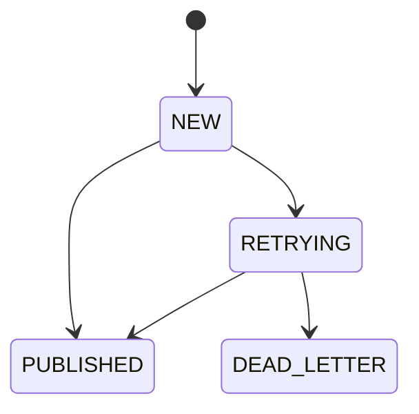
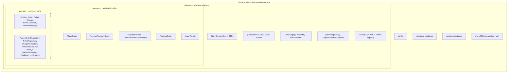

# Transaction Outbox (Go Monorepo) — Event Ticket System

A reliable ticket-ordering pipeline that accepts REST writes (`POST /api/v1/orders`),
guarantees **no order loss**, charges each order **exactly once** through a
pluggable payment gateway, and issues signed, QR-coded tickets once payment is
confirmed — implemented with the **Transactional Outbox** pattern over
RabbitMQ and Postgres.

---

## Why this exists

Publishing straight from an HTTP handler to a message broker is **lossy**: if the
broker is unreachable the moment the request arrives, the message is gone after
the client already received a `2xx`. The Transactional Outbox pattern fixes this:
the request is first committed to the database in the *same transaction* that
acknowledges the client, and a separate relay reliably forwards it to the broker.

| Concern | How it's solved |
|---|---|
| **No message loss** | The order is durably written to a Postgres `order_outbox` table before the client gets `201`. `DispatchOutbox` publishes to RabbitMQ with **publisher confirms**. The gateway's own payment confirmation gets the identical treatment via a second table, `payment_event_outbox`. |
| **Idempotency / no duplicates** | Deterministic dedup key (`sha256("order:" + sourceOrderId + optional Idempotency-Key)` for orders, `sha256(provider + rawEventId)` for gateway webhooks) is the outbox `UNIQUE` constraint **and** the RabbitMQ `MessageId`. `order-consumer-worker` also dedupes on `orders.source_order_id` (UNIQUE) — a redelivered message is a safe no-op insert. |
| **Poison messages** | Dead-letter exchange/queue (`tickets.dlx` → `<stream>.<type>.<subtype>.dlq`) after N redeliveries. |
| **Horizontal scaling** | `DispatchOutbox` polls with `FOR UPDATE SKIP LOCKED`; each consumer worker uses prefetch + manual ack, one instance per `(event_type, event_subtype)` shard. |

---

## Tech stack

| Layer | Technology | Version |
|---|---|---|
| Language | Go | **1.26.4** |
| HTTP framework | Gin (`github.com/gin-gonic/gin`) | latest |
| ORM | GORM (`gorm.io/gorm` + `gorm.io/driver/postgres`) | latest |
| Message broker | RabbitMQ (`rabbitmq:4.3-management`, **quorum queues**) | **4.3.2** |
| Database | PostgreSQL | **18** |
| Payment gateway | Stripe (`github.com/stripe/stripe-go/v82`) — real; `fake` sandbox is the local/test default | — |
| QR codes | `github.com/skip2/go-qrcode` | latest |
| AMQP client | `github.com/rabbitmq/amqp091-go` | latest |
| Config | `github.com/kelseyhightower/envconfig` | latest |
| Local orchestration | Podman Compose | — |

> **Go is not installed on the host.** All `go build`/`test`/`lint` commands run
> inside containers via `make` targets — see [Build / run commands](#build--run-commands-local-dev).

---

## Architecture

Six service binaries: **`ingestion-api`** (fixed 1 replica, HTTP write path —
orders + payment-gateway webhooks), **`outbox-worker`** (the Transactional
Outbox relay — its own process, running two independent dispatch loops,
one per outbox table, KEDA-scaled on their summed backlog, min 1),
**`order-consumer-worker`**, **`fulfillment-consumer-worker`** — these two run
**N instances each**, one per `(event_type, event_subtype)` shard (e.g.
`CONCERT`/`ROCK`), bound to exactly one RabbitMQ queue via `CONSUMER_QUEUE`
so KEDA can scale a shard's consumers independently, and
`fulfillment-consumer-worker` also emails each issued ticket's QR PNG
synchronously, no separate consumer needed — **`tickets-api`** (fixed
1 replica, a second synchronous HTTP write path: order-status polling,
staff-authenticated ticket check-in, ticket-holder name correction), and
**`notification-retry-cron`** (a Kubernetes CronJob, not a long-running
service — retries any ticket whose email didn't send the first time).

Two logical databases share one Postgres instance: `ingestion-api` and
`outbox-worker` use the **`outbox`** database (`order_outbox` +
`payment_event_outbox`); `order-consumer-worker`,
`fulfillment-consumer-worker`, `tickets-api`, and `notification-retry-cron`
use the **`events`** database
(`locations`/`events`/`producers`/`event_areas`/`orders`/`tickets`/`charges`/`staff_users`/`ticket_notifications`).
`ingestion-api` **never writes to the `events` database**, and symmetrically
`tickets-api` never touches the outbox tables or RabbitMQ.

```mermaid
flowchart LR
    Client([Client])
    Gateway([Payment gateway<br/>Stripe / fake])

    subgraph API["ingestion-api (fixed 1 replica)"]
        H[Gin HTTP handler<br/>orders + webhooks]
    end

    subgraph OW["outbox-worker (KEDA, min 1)"]
        R1[DispatchOutbox: orders<br/>poll · LISTEN/NOTIFY · publish · mark]
        R2[DispatchOutbox: payment events<br/>poll · publish · mark]
    end

    subgraph DB[(PostgreSQL 18 — one instance)]
        subgraph DBO["outbox database"]
            OBX[[order_outbox]]
            PEO[[payment_event_outbox]]
        end
        subgraph DBE["events database"]
            ORD[[orders / tickets / charges]]
        end
    end

    subgraph MQ["RabbitMQ 4.3 (quorum, one queue + DLQ per shard, per stream)"]
        EX{{tickets.exchange<br/>topic}}
        QO[["events.&lt;type&gt;.&lt;subtype&gt;.queue"]]
        QP[["payments.&lt;type&gt;.&lt;subtype&gt;.queue"]]
        DLX{{tickets.dlx}}
        EX --> QO & QP
        QO -. "max deliveries" .-> DLX
        QP -. "max deliveries" .-> DLX
    end

    subgraph OCW["order-consumer-worker — one per shard"]
        PO[ProcessOrder:<br/>reserve tickets, open checkout]
    end
    subgraph FCW["fulfillment-consumer-worker — one per shard"]
        IT[IssueTickets:<br/>QR + HMAC on CONFIRMED]
    end

    Client -- "POST /api/v1/orders" --> H
    H -- "tx: INSERT (idempotency_key UNIQUE, status=NEW, event_type/subtype)" --> OBX
    H -- "201 Created" --> Client
    OBX -. "NOTIFY order_outbox_new" .-> R1
    R1 -- "SELECT ... FOR UPDATE SKIP LOCKED" --> OBX
    R1 -- "publish (confirm, routing key = order.&lt;type&gt;.&lt;subtype&gt;)" --> EX
    R1 -- "mark PUBLISHED" --> OBX
    QO --> PO
    PO -- "reserve RESERVED tickets + PENDING charge" --> ORD
    PO -- "CreateCheckout" --> Gateway
    Gateway -- "webhook: POST /api/v1/webhooks/payments/{provider}" --> H
    H -- "tx: INSERT" --> PEO
    PEO -. "poll" .-> R2
    R2 -- "publish (routing key = payment.&lt;type&gt;.&lt;subtype&gt;)" --> EX
    QP --> IT
    IT -- "mark PAID + issue VALID tickets (QR/HMAC)" --> ORD
```

> This diagram is the core dataflow. In cloud, `Client` actually hits an ALB +
> AWS WAF in front of `ingestion-api` (not shown — see
> [Edge protection](#edge-protection-rate-limiting--waf)), all services deploy
> via Argo Rollouts canary steps (see [Canary deploys](#canary-deploys)), and
> Prometheus/Grafana observe every box above (see
> [Observability](#observability-prometheus--grafana)).

### End-to-end flow

```mermaid
sequenceDiagram
    autonumber
    participant Cl as Client
    participant API as ingestion-api (HTTP)
    participant PG as Postgres
    participant OW as outbox-worker
    participant MQ as RabbitMQ
    participant OCW as order-consumer-worker
    participant GW as Payment gateway
    participant FCW as fulfillment-consumer-worker

    Cl->>API: POST /api/v1/orders (+ optional Idempotency-Key)
    API->>API: orderId = uuid.NewV7()
    API->>API: key = sha256("order:" + sourceOrderId + key?)
    API->>PG: BEGIN; INSERT order_outbox (status=NEW) ON CONFLICT DO NOTHING; COMMIT
    API-->>Cl: 201 Created { orderId, idempotencyKey, status }
    loop DispatchOutbox poll (order_outbox)
        OW->>PG: SELECT status IN (NEW, RETRYING) FOR UPDATE SKIP LOCKED
        OW->>MQ: publish (persistent, MessageId=key, confirms)
        MQ-->>OW: confirm ACK
        OW->>PG: UPDATE status = PUBLISHED
    end
    MQ->>OCW: deliver (manual ack)
    OCW->>PG: upsert Location/Event, reserve Tickets, INSERT Charge (PENDING)
    OCW->>GW: CreateCheckout(orderId, amount, ...)
    GW-->>OCW: { providerRef, checkoutUrl }
    OCW->>MQ: ack
    Note over Cl,GW: customer pays at the gateway's hosted checkout page
    GW->>API: POST /api/v1/webhooks/payments/{provider}
    API->>API: VerifyWebhook (signature check)
    API->>PG: BEGIN; INSERT payment_event_outbox; COMMIT
    API-->>GW: 200 OK
    loop DispatchOutbox poll (payment_event_outbox)
        OW->>PG: SELECT status IN (NEW, RETRYING) FOR UPDATE SKIP LOCKED
        OW->>MQ: publish (persistent, confirms)
        OW->>PG: UPDATE status = PUBLISHED
    end
    MQ->>FCW: deliver (manual ack)
    FCW->>PG: tx: mark Charge/Order PAID, issue Tickets (QR PNG + HMAC signature), INSERT ticket_notifications
    FCW->>Mail: EmailSender.Send (QR PNG) — after the tx commits
    FCW->>PG: UPDATE ticket_notifications SET email_sent_timestamp / email_sent_error
    FCW->>MQ: ack
```

### After fulfillment: status polling, notification delivery, and check-in

`fulfillment-consumer-worker`'s ticket issuance isn't the end of the line —
three more things happen, all served by **`tickets-api`** and
**`notification-retry-cron`**, neither of which existed before Phase 8:

- **The client learns its checkout URL** by polling `GET
  /api/v1/orders/{orderId}` (`tickets-api`) after the original `201` —
  `checkoutUrl` is empty (and the endpoint may still legitimately `404`,
  since the `orders` row itself doesn't exist until
  `order-consumer-worker` runs) until `order-consumer-worker` opens a
  checkout, at which point it's populated and `status` reads `RESERVED`.
- **The ticket is emailed.** Right after `MarkIssued`,
  `fulfillment-consumer-worker` inserts a `ticket_notifications` row —
  inside the **same events-DB transaction**, since (unlike the RabbitMQ-based
  design this replaced) the table lives right alongside `tickets` now, so
  the insert is genuinely atomic with `MarkIssued`. Once that transaction
  commits, `fulfillment-consumer-worker` emails the QR PNG synchronously via
  the configured `EmailSender` (`fake` locally, or `smtp`, a real
  `net/smtp`-based sender using only the Go standard library) and records
  the outcome on that row. If the send fails, **`notification-retry-cron`**
  — a Kubernetes CronJob, no RabbitMQ involved — wakes up on a schedule and
  retries any row still missing `email_sent_timestamp`.
- **The ticket gets checked in at the door.** `POST /api/v1/checkin`
  (`tickets-api`, **staff-authenticated** — a Bearer token verified via
  Clerk, or the `fake` provider locally/in tests) verifies the scanned
  QR's HMAC signature against the ticket's *stored* row, optionally
  checks the authenticated staff member's venue scope, and flips
  `VALID` → `CHECKED_IN` (idempotent — a repeat scan reports
  `ALREADY_CHECKED_IN`, not an error). A typo'd buyer name can be
  corrected at any point via `PATCH /api/v1/tickets/{ticketId}/holder`
  (rate-limited, no auth).

### Outbox status state machine



`RETRYING` increments `retry_count` on every failed publish attempt; once
`retry_count` reaches `MAX_RETRIES` the row moves to `DEAD_LETTER` and
`DispatchOutbox` stops retrying it. Both `order_outbox` and
`payment_event_outbox` share this identical state machine and are relayed by
the same generalized `DispatchOutbox` implementation.

---

## Clean Architecture

The codebase follows Clean Architecture. The **dependency rule** points inward:
outer layers depend on inner layers, never the reverse. The `domain` layer is pure
Go — it has **no imports** of Gin, GORM, RabbitMQ, or the Stripe SDK. Those
frameworks live in the outer layers and are injected at the composition root
(`cmd/*/main.go`).



| Layer | Responsibility | May import |
|---|---|---|
| `domain` | Entities + port interfaces | nothing external |
| `usecase` | Application flows (`PlaceOrder`, `ReceivePaymentEvent`, `DispatchOutbox`, `ProcessOrder`, `IssueTickets`) | `domain` only |
| `adapter` | Gin handlers, GORM repositories, RabbitMQ pub/consumer, payment gateway adapters, QR generation | `domain`, `usecase` |
| `infrastructure` | Config, DB/MQ bootstrap, `main` wiring (DI) | all of the above |

> GORM-tagged structs live **only** in `adapter/persistence`. Domain entities are
> plain structs; repositories map between the two so inner layers stay framework-free.

`internal/observability` is a small dependency-free leaf (same idea as
`internal/domain/pii`): two helpers — `Int64Counter`/`Int64Gauge` — that wrap
OTel metric-instrument construction and log the (spec-guaranteed-non-fatal)
creation error once, so `usecase/outbox`, `usecase/checkout`,
`usecase/fulfillment`, `adapter/messaging`, and `adapter/http/ratelimit` don't
each repeat the same "log the error, then nil-check every call site"
boilerplate. Any layer may import it, the same way any layer may import
`domain/pii`.

---

## Components

- **`ingestion-api`** — Gin HTTP server exposing `POST /api/v1/orders`,
  `POST /api/v1/webhooks/payments/{provider}`, and `/healthz`. Pre-generates
  the Order UUID, computes the idempotency key from the order's own
  identity, writes **only** to `order_outbox` (in the `outbox` database)
  inside a transaction (status `NEW`), returns `201 Created`. The webhook
  route verifies the gateway's signature via the configured
  `PaymentGateway.VerifyWebhook` and writes `payment_event_outbox`. Runs at a
  fixed 1 replica and does **not** connect to RabbitMQ or the `events`
  database.
- **`outbox-worker`** — the Transactional Outbox core, its own process,
  running two independent `DispatchOutbox` loops (one per outbox table):
  polls `NEW`/`RETRYING` rows (deduped via `FOR UPDATE SKIP LOCKED`,
  `order_outbox` also gets a LISTEN/NOTIFY fast path), publishes to RabbitMQ
  with publisher confirms, marks rows `PUBLISHED` (or `RETRYING`/
  `DEAD_LETTER` on failure with exponential backoff), prunes old published
  rows, and declares the shared RabbitMQ topology. KEDA scales it on the
  **summed** backlog of both outboxes (postgresql scaler), min 1.
- **`order-consumer-worker`** — RabbitMQ consumer with prefetch + manual ack,
  one instance per `(event_type, event_subtype)` shard. Upserts the
  `Location`/`Event` an order belongs to, reserves `Ticket` rows
  (`RESERVED`), opens a checkout with the configured `PaymentGateway`, and
  persists a `Charge` (`PENDING`). Dedupes via the `orders.source_order_id`
  `UNIQUE` constraint.
- **`fulfillment-consumer-worker`** — RabbitMQ consumer, same per-shard
  shape. On a `CONFIRMED` payment-gateway webhook it marks the `Charge`/
  `Order` `PAID` and issues every `RESERVED` ticket (QR PNG + HMAC
  signature); on `FAILED` it marks them `FAILED`/`VOID`. Right after issuing
  a ticket it also inserts a `ticket_notifications` row **inside the same
  events-DB transaction** as the issuance itself (both tables live in
  `events` now, so this is genuinely atomic), then — once that transaction
  commits — emails the QR PNG synchronously via the configured
  `EmailSender` (`fake` or `smtp`), recording the outcome on that row.
- **`tickets-api`** — a second Gin HTTP server, the mirror image of
  `ingestion-api`: reads/writes the `events` database directly and never
  touches RabbitMQ or the outbox tables. `GET /api/v1/orders/{id}` (order
  status + checkout URL), `POST /api/v1/checkin` (staff-authenticated —
  Bearer token verified via Clerk or the `fake` local/test provider — QR
  signature verification + venue scoping), `PATCH
  /api/v1/tickets/{id}/holder` (buyer-name correction, rate-limited, no
  auth). Fixed 1 replica.
- **`notification-retry-cron`** — a Kubernetes `CronJob`, not a long-running
  service and not a RabbitMQ consumer: on a schedule (every 2 minutes by
  default), it retries any `ticket_notifications` row still missing
  `email_sent_timestamp` whose backoff window has passed, via the same
  configured `EmailSender`, then exits.
- **PostgreSQL** — one instance, two logical databases: `outbox`
  (`order_outbox` + `payment_event_outbox`) and `events`
  (`locations`/`events`/`producers`/`event_areas`/`orders`/`tickets`/`charges`/`staff_users`/`ticket_notifications`).
- **RabbitMQ** — durable topic exchange (`tickets.exchange`) + one quorum
  queue + dead-letter queue per `(stream, event_type, event_subtype)` shard.
- **`outbox-admin`** — a one-shot maintenance CLI, **not** a long-running
  service. Three subcommands, all driven by `make`:
  `replay-dead --outbox order --event-type CONCERT --limit 100` resets
  `DEAD_LETTER` rows in `order_outbox` (or `payment_event_outbox` with
  `--outbox payment`) back to `NEW` so the existing dispatch loop republishes
  them; `drain-dlq --stream order --event-type CONCERT --event-subtype ROCK`
  moves messages sitting in a shard's DLQ back onto its queue;
  `purge-loadtest-dlq --stream order --event-type CONCERT --event-subtype ROCK`
  scans a DLQ and permanently removes only messages a loadtest run marked
  (`customerName`/`provider` = `"LOADTEST"`), leaving any other message
  untouched — safe to run against a DLQ with a mix of real and loadtest
  messages, e.g. after load-testing in a UAT environment. Operates on the
  `outbox` database (`DATABASE_URL` points at it, same as ingestion-api/
  outbox-worker) plus `RABBITMQ_URL`, but never binds an HTTP port. See `make replay-dead` / `make drain-dlq` /
  `make purge-loadtest-dlq` and
  [`cmd/outbox-admin/main.go`](cmd/outbox-admin/main.go).

---

## Order wire format

```json
{
  "sourceOrderId": "order-abc123",
  "eventType": "CONCERT",
  "eventSubtype": "ROCK",
  "eventId": "evt_rock_in_rio_2026",
  "eventName": "Rock in Rio",
  "venue": { "id": "venue-1", "name": "Estadio Nacional", "city": "Sao Paulo" },
  "tickets": [
    { "id": "TKT-1", "section": "A", "row": "10", "seat": "5", "price": 150.00, "currency": "BRL" }
  ],
  "customer": { "name": "Jane Doe", "email": "jane@example.com", "document": "12345678900" }
}
```

- `eventType`/`eventSubtype` must be a registered pair
  (`internal/infrastructure/rabbitmq.EventTypes`) — an unregistered pair has
  no bound RabbitMQ queue and is rejected `400` rather than silently
  vanishing into a topic-exchange black hole.
- `tickets[].price` is a decimal float in currency units on the wire; the
  handler converts it to `int64` minor units (cents) immediately — domain and
  persistence code never see a float. All tickets in one order must share one
  `currency` — mixed-currency orders aren't supported.
- `venue`/`eventName` are upserted into the `events` database's
  `locations`/`events` tables, keyed by `venue.id`/`eventId` respectively —
  a redelivered order for a venue/event already seen is a safe no-op update,
  not a duplicate row.

### Event type / subtype registry

| Event type | Subtypes |
|---|---|
| `CONCERT` | `ROCK`, `POP`, `ELECTRONIC`, `SAMBA` |
| `SPORTS` | `FOOTBALL`, `BASKETBALL`, `UFC` |
| `THEATER` | `PLAY`, `STANDUP`, `MUSICAL` |
| `CONFERENCE` | `TECH`, `BUSINESS` |

**A pair outside this table is rejected with `400`** — each pair routes to
its own dedicated RabbitMQ queue (see the diagram above), so an unrecognized
pair has no bound queue and would be silently dropped by the broker if
accepted. See `ValidateEventType` in
[`internal/adapter/http/order_dto.go`](internal/adapter/http/order_dto.go) and
`EventTypes` in
[`internal/infrastructure/rabbitmq/rabbitmq.go`](internal/infrastructure/rabbitmq/rabbitmq.go)
to add a new pair — registry-only, no other code path needs to change.

```bash
make seed              # CONCERT/ROCK sample
make seed-order-sports  # SPORTS/FOOTBALL sample
```

## Payment gateway

`internal/domain.PaymentGateway` is the only place this system touches
payment — `order-consumer-worker` calls `CreateCheckout` to open a
gateway-hosted checkout for an order, and the gateway's own webhook (verified
via `VerifyWebhook`, called from ingestion-api's webhook handler) confirms or
fails it, which `fulfillment-consumer-worker` acts on.

| Provider | Adapter | Status |
|---|---|---|
| Stripe | `internal/adapter/paymentgateway/stripe` | Real — Checkout Sessions + signature-verified webhooks |
| `fake` | `internal/adapter/paymentgateway/fake` | Sandbox — no network calls; the default locally/in tests/k6 |
| AbacatePay | `internal/adapter/paymentgateway/abacatepay` | Stub — scaffolded, returns `ErrNotImplemented` |
| LemonSqueezy | `internal/adapter/paymentgateway/lemonsqueezy` | Stub — scaffolded, returns `ErrNotImplemented` |

Selected via `PAYMENT_PROVIDER` (`fake` default). No card data (PAN, CVV)
ever reaches this system — payment happens on the gateway's own hosted
checkout page, which is also why there's no PCI-DSS card-data scope anymore
(see [`SECURITY.md`](SECURITY.md)).

`event_type`/`event_subtype` round-trip through the gateway's own metadata
(e.g. a Stripe Checkout Session's `metadata`) so `ingestion-api` can route the
webhook onto the right shard's queue **without ever reading the `events`
database** — it only ever writes outbox rows, by design.

## Ticket issuance

Once `fulfillment-consumer-worker` sees a `CONFIRMED` payment event, it
issues every `RESERVED` ticket for the order:

- a random `validationCode`,
- an HMAC-SHA256 `signature` over `ticketID + ":" + validationCode` (key:
  `TICKET_SIGNING_SECRET`),
- a compact `qrContent` token embedding both, rendered as a **PNG**
  (`internal/adapter/ticketqr`, via `github.com/skip2/go-qrcode`).

Nothing is persisted or shown to the customer until the `Charge` is
confirmed `PAID` — a `FAILED` payment marks the reservation `VOID` instead.

## Idempotency / dedup keys

Two independent formulas, both `sha256`-derived from the caller's own event
identity, never a server-generated UUID:

```
order key   = sha256( "order:" + sourceOrderId + Idempotency-Key? )
webhook key = sha256( provider + ":" + rawEventId )
```

- **Orders**: a redelivered order carries the same `sourceOrderId`. No
  `Idempotency-Key` header → redeliveries collapse into a single outbox row.
  With the header → it's folded into the hash, so two genuinely distinct
  requests are never wrongly merged.
- **Payment-gateway webhooks**: the gateway's own event id is the dedup
  boundary — never `ProviderRef` (one charge can, in principle, emit more
  than one event over its lifetime).

Both keys are the outbox `UNIQUE` constraint and the RabbitMQ `MessageId`. A
dedup hit on the ingest side is exported as `order_ingestion.duplicate_total`/
`webhook_ingestion.duplicate_total` (by `event_type`/`event_subtype` or
`provider`), in addition to the `dedup_hit` span attribute.

### Consumer outcome taxonomy

A duplicate delivery hitting a `UNIQUE` constraint is **not an error** —
`OrderRepository.Save`/`ChargeRepository`'s terminal-status check report it
via a `created`/no-op return (mirroring how `OutboxRepository.Enqueue`
already tells the ingestion use-cases an `"accepted"` apart from a
`"duplicate"`), so `ProcessOrder`/`IssueTickets` and `AMQPConsumer.handle`
can tell it apart from both a fresh save and a genuine processing error.
Every code path tags the **same `outcome` attribute name** — on the span, on
the `consumer.messages_processed_total` metric, and (for the non-`ack`/
`saved` cases) on a structured `slog` field — so all three OTel signals
agree on one vocabulary you can filter/group by in Grafana/Loki alike:

| `outcome` | Meaning | Retried? | Reaches DLQ? |
|---|---|---|---|
| `saved` / `ack` | Fresh row(s) persisted | — | — |
| `duplicate` | Already processed — a safe redelivery no-op | No — Ack'd immediately | No |
| `retry_scheduled` | Transient processing error, requeued via the shard's `*.retry` queue with backoff | Yes, up to `MAX_DELIVERIES` | Eventually, if retries exhaust |
| `poison_dlq` | `MAX_DELIVERIES` exhausted | No — terminal | Yes |
| `unknown_schema_version` | `schemaVersion` newer/unrecognized — structurally can never succeed | No — DLQ'd on the **first** attempt | Yes |

`duplicate` and `unknown_schema_version` never loop: both are decided by a
condition that's independent of delivery count, so neither one ever enters
the retry machinery in the first place.

---

## Message ordering

**This system does not preserve message order, and deliberately doesn't need
to.** Orders and tickets here are **absolute-state records** keyed by their
own source identity (`source_order_id`, `source_ticket_id`), not a delta
like `balance += amount`, so persisting them in any order lands the same
rows. That's *why* it's safe to scale consumers horizontally (KEDA runs
0–N pods per shard queue — the competing-consumers pattern, which has no
ordering guarantee) and why each consumer processes one delivery at a time
per pod rather than reordering its own input.

The transactional-outbox pattern itself only guarantees **at-least-once
delivery to the broker** with producer-side atomicity; it never promised
ordered or exactly-once *consumption*. Consumer correctness rests on the
idempotent-consumer dedup above, which is order-independent.

### If a future requirement *does* need ordering

Say a ticket lifecycle needs strict ordering (e.g. `RESERVED → PAID →
CHECKED_IN` applied out of order corrupts state). The goal is then
**per-entity ordering** (all events for one order/ticket in sequence) while
still processing *different* entities in parallel — never global ordering,
which would mean single-threading everything and forfeiting throughput.

The RabbitMQ-native way to get that, without migrating to Kafka:

1. **Consistent-hash exchange** (the `rabbitmq-consistent-hash-exchange`
   plugin) keyed on the ordering identity (e.g. `orderId`) instead of the
   current topic exchange. The hash routes **all of one entity's messages to
   the same queue**, while different entities spread across queues — so
   order is preserved per entity but parallelism is kept across entities.
2. **Exactly one consumer per queue** — either run a single replica per
   shard queue, or declare the queue with `x-single-active-consumer: true` so
   only one consumer is ever active (the rest stand by for failover). This
   keeps each queue's single-threaded, in-order processing (which
   `AMQPConsumer.Run` already does per pod) as the *only* consumer of that
   queue, so the broker can't hand message 2 to a second consumer before
   message 1 is done.

Ordering must hold across **all three hops** — so this also requires the
dispatcher to poll in order (`FetchPending` ordered by `created_at, id`) and,
if more than one dispatcher replica runs, to shard its `FOR UPDATE SKIP
LOCKED` claim by the same ordering key so one entity's rows are always
claimed by one dispatcher.

A lighter-weight alternative that keeps full parallelism is to make ordering
**idempotent at the data layer** instead of the transport: guard writes with
a monotonic status/version check, so a stale event physically can't overwrite
a newer one and out-of-order delivery self-corrects.

---

## Project structure

```
TransactionOutboxGo/
├── .claude/plan-phase8-tickets-checkin-notifications.md   # the current architecture (Phase 8)
├── CLAUDE.md                  # guidance for Claude Code in this repo
├── cmd/
│   ├── ingestion-api/               # HTTP write path → both intake outbox tables (composition root)
│   ├── outbox-worker/               # two DispatchOutbox loops → RabbitMQ, KEDA-scaled (composition root)
│   ├── order-consumer-worker/       # order_outbox consumer → events DB (composition root)
│   ├── fulfillment-consumer-worker/ # payment_event_outbox consumer → events DB, also emails issued tickets (composition root)
│   ├── tickets-api/                 # order-status/check-in/ticket-holder HTTP path → events DB (composition root)
│   ├── notification-retry-cron/     # Kubernetes CronJob: retries unsent ticket_notifications rows (composition root)
│   └── outbox-admin/                # one-shot maintenance CLI: replay-dead / drain-dlq / purge-loadtest-dlq
├── internal/
│   ├── domain/                # entities (Order, Ticket, Charge, Event, Location, OutboxMessage, TicketNotification, StaffUser) + ports (no framework imports)
│   ├── observability/         # tiny OTel metric-instrument helpers shared by usecase + adapter (no framework imports beyond the otel API)
│   ├── usecase/                # order / webhook / outbox / checkout / fulfillment / checkin / ticketholder / notification
│   ├── adapter/                # http (incl. staffauth) · persistence · messaging · paymentgateway · emailsender · staffauth · ticketqr
│   └── infrastructure/         # config · database · rabbitmq (EventTypes registry + topology) · telemetry · logging
├── migrations/
│   ├── outbox/                 # golang-migrate set for the `outbox` database
│   └── events/                 # golang-migrate set for the `events` database
├── tests/integration/          # TestContainers suite (Postgres + RabbitMQ) — see Testing below
├── backstage/                  # Backstage developer portal (Node/TS) — Software Catalog + API docs + TechDocs
├── catalog-info.yaml           # Backstage System/Group/Component/API entities for this repo
├── mkdocs.yml, docs/index.md   # TechDocs source, rendered by Backstage
├── docker-compose.yml
├── Dockerfile
└── Makefile
```

---

## Environment variables

All six service binaries read config via [`internal/infrastructure/config`](internal/infrastructure/config/config.go)
(`envconfig`). `DATABASE_URL` and `RABBITMQ_URL` are the only two marked
`required` — everything else has a default. (ingestion-api and
notification-retry-cron still require `RABBITMQ_URL` to be set because the
`Config` struct is shared, even though neither of them ever opens a RabbitMQ
connection — same "provide but ignore" precedent both follow.) Each
service points `DATABASE_URL` at its own logical database: `outbox` for
ingestion-api/outbox-worker, `events` for order-consumer-worker/
fulfillment-consumer-worker/tickets-api/notification-retry-cron. See
[`.env.example`](.env.example) for local-dev values and
[`docker-compose.yml`](docker-compose.yml) for how each service's env block
is wired.

### Shared (all six services)

| Variable | Default | Meaning |
|---|---|---|
| `DATABASE_URL` | *(required)* | Postgres DSN — `outbox` DB for ingestion-api/outbox-worker, `events` DB for the consumer workers |
| `RABBITMQ_URL` | *(required)* | AMQP connection string (unused by ingestion-api) |
| `OTEL_SERVICE_NAME` | `transaction-outbox-go` | OTel resource service name — each service/shard overrides this to its own name (e.g. `order-consumer-worker-concert-rock`) |
| `OTEL_EXPORTER_OTLP_ENDPOINT` | `localhost:4318` | OTLP/HTTP collector endpoint (Tempo in local dev) |
| `METRICS_PORT` | `9090` | Prometheus `/metrics` port — outbox-worker uses `9098`; each shard's consumer worker overrides this to its own fixed port (see `docker-compose.yml`) |

### `ingestion-api` only

| Variable | Default                                      | Meaning |
|---|----------------------------------------------|---|
| `HTTP_PORT` | `8080`                                       | HTTP listen port |
| `SWAGGER_ENABLED` | `false`                                      | Serve swagger UI at `/swagger/index.html` (local dev defaults this to `true`; production leaves it `false`) |
| `RATE_LIMIT_ENABLED` | `false` locally, `true` in cloud Helm values | Leaky-bucket IP rate limiter (see [Edge protection](#edge-protection-rate-limiting--waf) below). Off by default in `docker-compose.yml`/`.env.example` so k6 load tests and seed scripts don't throttle themselves |
| `RATE_LIMIT_RATE` | `50`                                         | Leak rate, requests/second per client IP |
| `RATE_LIMIT_BURST` | `100`                                        | Bucket capacity (requests admitted immediately before throttling kicks in) |
| `TRUSTED_PROXIES` | *(empty)*                                    | Comma-separated CIDRs Gin trusts for `X-Forwarded-For` when resolving `c.ClientIP()`. Empty locally (no proxy in front, uses `RemoteAddr` directly); set to the VPC/private-subnet CIDRs in cloud, where the ALB sits in front and injects XFF |
| `PAYMENT_PROVIDER` | `fake` | `PaymentGateway` adapter to build (`fake`/`stripe`/`abacatepay`/`lemonsqueezy`) — also read by `order-consumer-worker` |
| `STRIPE_SECRET_KEY` / `STRIPE_WEBHOOK_SECRET` | *(empty)* | Only meaningful when `PAYMENT_PROVIDER=stripe` |

### `outbox-worker` only

| Variable | Default | Meaning |
|---|---|---|
| `OUTBOX_DISPATCH_INTERVAL_MS` | `250` | Poll interval for both dispatch loops (the LISTEN/NOTIFY fast path wakes the order one sooner on enqueue) |
| `OUTBOX_DISPATCH_BATCH_SIZE` | `50` | Rows fetched per dispatch poll |
| `OUTBOX_MAX_RETRIES` | `5` | Publish attempts before an outbox row is marked `DEAD_LETTER` |
| `OUTBOX_PRUNE_AFTER_HOURS` | `48` | Hours after which a `PUBLISHED` row is eligible for pruning |
| `RETRY_BACKOFF_BASE` / `RETRY_BACKOFF_CAP` | `1s` / `5m` | Exponential-backoff bounds for `next_retry_at` scheduling (shared with the consumer workers' retry-queue TTL) |

### `order-consumer-worker` / `fulfillment-consumer-worker` only

| Variable | Default | Meaning |
|---|---|---|
| `CONSUMER_QUEUE` | *(required — no default)* | The single RabbitMQ queue this instance binds to and drains, e.g. `events.concert.rock.queue` (order) or `payments.concert.rock.queue` (fulfillment). Must resolve via `rmq.ParseQueueName` — the binary fails fast at startup if it's empty, unrecognized, or on the wrong stream for that binary |
| `PREFETCH_COUNT` | `10` | AMQP consumer prefetch count |
| `MAX_DELIVERIES` | `5` | Redelivery attempts before a message is routed to its shard's DLQ |
| `CHECKOUT_SUCCESS_URL` | `http://localhost:8080/orders/success` | `order-consumer-worker` only — where the gateway redirects the customer after a successful checkout |
| `TICKET_SIGNING_SECRET` | `dev-ticket-signing-secret` | `fulfillment-consumer-worker`/`tickets-api` — HMAC key for ticket validation signatures (issuance and check-in verification both use it) |

### `tickets-api` only

| Variable | Default | Meaning |
|---|---|---|
| `HTTP_PORT` | `8080` | HTTP listen port |
| `RATE_LIMIT_ENABLED` / `RATE_LIMIT_RATE` / `RATE_LIMIT_BURST` | same as ingestion-api | Guards only `PATCH /api/v1/tickets/{id}/holder` — `GET /orders/{id}` and `POST /checkin` are unlimited |
| `STAFF_AUTH_PROVIDER` | `fake` | `StaffAuthenticator` adapter for check-in: `fake` (fixed test token, no network) or `clerk` (real) |
| `CLERK_SECRET_KEY` | *(empty)* | Only meaningful when `STAFF_AUTH_PROVIDER=clerk` |
| `STAFF_AUTH_FAKE_TOKEN` / `STAFF_AUTH_FAKE_CLERK_USER_ID` | `dev-staff-token` / `dev-staff-user` | Only meaningful when `STAFF_AUTH_PROVIDER=fake` |

### `fulfillment-consumer-worker` / `notification-retry-cron` email settings

| Variable | Default | Meaning |
|---|---|---|
| `EMAIL_PROVIDER` | `fake` | `EmailSender` adapter: `fake` (no network) or `smtp` (real, stdlib `net/smtp`) |
| `SMTP_HOST` / `SMTP_PORT` / `SMTP_USERNAME` / `SMTP_PASSWORD` | *(empty)* / `587` / *(empty)* / *(empty)* | Only meaningful when `EMAIL_PROVIDER=smtp` |
| `SMTP_FROM_EMAIL` / `SMTP_FROM_NAME` | `tickets@example.com` / `Event Tickets` | Sender identity on outgoing mail |

### `notification-retry-cron` only

| Variable | Default | Meaning |
|---|---|---|
| `NOTIFICATION_RETRY_BATCH_SIZE` | `50` | Max `ticket_notifications` rows retried per run |

---

## Build / run commands (local dev)

Go is **not installed on the host** — everything runs inside containers via
Podman.

```bash
# Build, test, lint — all run inside golang:1.26-alpine / golangci-lint via Podman
make build    # go build ./...
make test     # go test -race ./...
make tidy     # go mod tidy
make lint     # golangci-lint run ./...

# Podman Compose — starts Postgres + RabbitMQ + all six app services +
# Backstage (two shards run by default: CONCERT/ROCK, SPORTS/FOOTBALL)
make up       # podman compose -f docker-compose.yml up --build -d
make logs     # tail logs from all services
make down     # podman compose -f docker-compose.yml down -v
make seed     # curl a sample order POST to the ingestion-api

# Backstage on its own (heavier Node build than the rest of `make up`)
make backstage-build
make backstage-up

# Regenerate ingestion-api's and tickets-api's Swagger specs
make swag
```

### Endpoints once `make up` is healthy

| Service | URL |
|---|---|
| Ingestion API | http://localhost:8080 |
| API health | http://localhost:8080/healthz |
| Ingestion API Swagger UI | http://localhost:8080/swagger/index.html |
| Tickets API | http://localhost:8081 |
| Tickets API Swagger UI | http://localhost:8081/swagger/index.html |
| Backstage developer portal | http://localhost:7007 |
| RabbitMQ management UI | http://localhost:15672 (user/pass from `.env`) |
| Postgres | `localhost:5432` |

### Send a request

```bash
curl -i -X POST http://localhost:8080/api/v1/orders \
  -H "Content-Type: application/json" \
  -H "Idempotency-Key: order-123" \
  -d '{"sourceOrderId":"order-123","eventType":"CONCERT","eventSubtype":"ROCK","eventId":"evt_rock_in_rio","eventName":"Rock in Rio","venue":{"id":"venue-1","name":"Estadio Nacional","city":"Sao Paulo"},"tickets":[{"id":"TKT-1","section":"A","row":"10","seat":"5","price":150.00,"currency":"BRL"}],"customer":{"name":"Jane Doe","email":"jane@example.com","document":"12345678900"}}'
```

Expect `201 Created` with an `orderId`, `idempotencyKey`, and `status: "accepted"`.

### Verifying it works

- **Persistence:** the outbox row moves `NEW → PUBLISHED`, flows through that
  shard's own queue (e.g. `events.concert.rock.queue`, visible in the
  RabbitMQ UI), and lands as `Order`/`Ticket`(`RESERVED`)/`Charge`(`PENDING`)
  rows in the `events` database.
- **Idempotency:** repeat the same `curl` → response comes back
  `status: "duplicate"`; still a single set of rows.
- **Loss resistance:** `podman compose -f docker-compose.yml stop rabbitmq`,
  send a request (still `201`, outbox row stays `NEW`), then restart RabbitMQ →
  `DispatchOutbox` drains the backlog and `order-consumer-worker` processes it.
- **Fulfillment:** confirm the fake gateway's checkout by POSTing to
  `/api/v1/webhooks/payments/fake` with the `Charge`'s `provider_ref` (see
  `make seed-webhook-confirm` and its comment for the exact command) — the
  ticket moves `RESERVED → VALID` with a non-empty `qr_png`.
- **Per-shard isolation:** `make seed-order-sports` then check the RabbitMQ
  UI — the message lands only in `events.sports.football.queue`; the
  CONCERT/ROCK queue stays untouched.

---

## Testing

Two suites, deliberately split by what they need to run:

| Suite | Command | Needs | What it covers |
|---|---|---|---|
| Unit | `make test-unit` | nothing — pure Go | `usecase`/`adapter`/`domain` logic against hand-written fakes/mocks of the `domain` ports (`OutboxRepository`, `Publisher`, `UnitOfWork`, ...) |
| Integration | `make test-integration` | Podman socket reachable from inside the test container (TestContainers) | The same code wired to **real** Postgres 18 and RabbitMQ 4.3 containers — migrations, GORM repos, the AMQP publisher/consumer, `LISTEN`/`NOTIFY`, retry backoff, DLQ replay, the full order → checkout → webhook → fulfillment pipeline |

Both are plain `go test`, gated behind the `integration` build tag for the
second suite (`tests/integration/*_test.go` all start with
`//go:build integration`) — `go build ./...` and `make test-unit` never touch
them.

### Integration suite (TestContainers)

[`tests/integration/suite_test.go`](tests/integration/suite_test.go) spins up
**one Postgres + one RabbitMQ container pair for the whole package**
(`TestMain`), applies the real `migrations/` directory via `golang-migrate`
(no `AutoMigrate`), and wires the actual `PlaceOrder` / `ReceivePaymentEvent`
/ `DispatchOutbox` / `ProcessOrder` / `IssueTickets` use-cases against them —
`truncateAll` resets tables and purges every registered shard's queues
between tests instead of restarting containers, so the suite stays fast. It
needs the Podman socket mounted into the test container (`make
test-integration` does this for you) and runs in CI only when explicitly
requested (`workflow_dispatch` or a `ci:integration` PR label — see
[CI/CD](#cicd) below), since it's a safety net, not a release gate.

It exercises things a pure-mock unit test structurally can't: the
`FOR UPDATE SKIP LOCKED` dispatch query against concurrent dispatchers, the
`orders.source_order_id` `UNIQUE` constraint actually rejecting a redelivered
order, a poison message really landing in its shard's DLQ after
`MAX_DELIVERIES`, `ReplayDeadLetters` resetting real rows, the
`LISTEN`/`NOTIFY` wakeup path (`internal/infrastructure/database.Listener`),
a second shard routing to its own queue (not the first shard's), and a full
end-to-end run — HTTP order placement → relay → `order-consumer-worker`
reserves tickets + opens a fake checkout → HTTP webhook confirms → relay →
`fulfillment-consumer-worker` issues tickets with a signature independently
re-verified via `ticketqr.Verify`.

### Coverage

```bash
make coverage-all   # runs test-unit + test-integration, merges the two
                     # profiles (gocovmerge, fetched ad hoc — never added to
                     # go.mod), prints the combined % and writes
                     # merged-coverage.html
```

Measured against real Postgres 18 + RabbitMQ 4.3 testcontainers
(`go test -tags=integration -race`, all tests passing, weighted by
statement count, not a naive average of per-function percentages). **Every
`internal/usecase/*` subpackage is required to individually clear 75%**

| Package | Coverage |
|---|---|
| `usecase/outbox` | 86.6% |
| `usecase/checkout` | 84.1% |
| `usecase/order` | 81.8% |
| `usecase/fulfillment` | 79.7% |
| `usecase/webhook` | 76.5% |
| `adapter/persistence` | 85.4% |
| `adapter/messaging` | 66.0% |

Phase 8's new `usecase/checkin`/`usecase/ticketholder`/`usecase/notification`
packages are exercised end-to-end by the integration suite
(`checkin_test.go`/`ticketholder_test.go`/`notification_test.go`) following
the same convention as every other `usecase` package — a per-package
percentage for these three hasn't been re-measured since Phase 7's
statement-weighted pass above; re-run `make coverage-all` for current
numbers across all eight `usecase` packages.

A unit-only number understates real coverage here on purpose:
`adapter/persistence`, `infrastructure/database`, and `infrastructure/rabbitmq`
are thin wrappers over GORM/pgx/amqp091 that are exercised against the
**real** dependency in the integration suite rather than mocked in a unit
test, so `make coverage-all` — not `make test-unit` alone — is the number
that reflects this project's actual line coverage.

---

## CI/CD

Six independent GitHub Actions workflows, one per microservice —
[`ingestion-api.yml`](.github/workflows/ingestion-api.yml),
[`outbox-worker.yml`](.github/workflows/outbox-worker.yml),
[`order-consumer-worker.yml`](.github/workflows/order-consumer-worker.yml),
[`fulfillment-consumer-worker.yml`](.github/workflows/fulfillment-consumer-worker.yml),
[`tickets-api.yml`](.github/workflows/tickets-api.yml), and
[`notification-retry-cron.yml`](.github/workflows/notification-retry-cron.yml)
— so a change scoped to one service never triggers or gates the others. All follow:
**Build → lint (golangci-lint + actionlint + helm lint + govulncheck) → Unit Tests → Upload
(ECR, OIDC-authenticated)**, with an optional flag-gated Integration Tests
(TestContainers) job that's a safety measure only — it never blocks Upload.
There is no automated deploy job. `govulncheck` (Go vulnerability scanning,
checking `go.sum`'s dependency tree for CVEs actually reachable from this
code's call graph) is wired into all six workflows as of Phase 8 — it
caught a real, reachable CVE in `go-jose/v3` (pulled in transitively by the
new Clerk SDK dependency) on its first run, fixed by bumping that
dependency directly. See
[`.github/workflows/README.md`](.github/workflows/README.md) for the full
gate breakdown and why six files instead of one matrixed workflow.

## Deploying

Cloud provisioning previously lived in `infra/pulumi/` (Pulumi/AWS: EKS, RDS,
Amazon MQ, ECR, KEDA, Argo Rollouts, the AWS Load Balancer Controller); that's
been removed from this repo. **Helm + KIND is the deploy/test path now** —
[`infra/kind/`](infra/kind/) brings up a local cluster and
[`helmcharts/transaction-outbox`](helmcharts/transaction-outbox/) installs the
app onto it (`make k8s-apply` / `make k8s-template` / `make k8s-lint`). A real
cloud target (a from-scratch Terraform/Pulumi/eksctl setup, or applying the
same chart to an existing cluster) may come back as its own initiative later —
the chart itself already supports the cloud-target values (`externalSecrets`,
`pgbouncer`, `canary`, node selectors, ALB `Ingress`) described elsewhere in
this README; they just aren't provisioned by anything in this repo right now.

---

## Edge protection: rate limiting + WAF

`ingestion-api` is the only publicly reachable service, so it carries two
layers of per-IP throttling — defense in depth, not redundancy:

1. **App-level leaky bucket** ([`internal/adapter/http/ratelimit`](internal/adapter/http/ratelimit/)) —
   an in-process, per-pod meter keyed on `c.ClientIP()`. Each client IP leaks
   at `RATE_LIMIT_RATE` req/s with a burst capacity of `RATE_LIMIT_BURST`;
   once exhausted, requests get `429 Too Many Requests` with a `Retry-After`
   header. `/healthz`, `/metrics`, `/swagger`, and the payment-gateway webhook
   route are exempt — only `/api/v1/orders` is limited (a gateway calls back
   from its own infrastructure, not a single abusive client IP, so throttling
   it would just drop legitimate payment confirmations). This is the
   **only** layer present locally (no ALB/WAF in `docker-compose.yml`), and
   is **off by default** there (see the env var table above) so k6/seed
   scripts don't throttle themselves.
   - **Caveat:** with `ingestionApi.hpa` scaling `1→10` replicas and no shared
     store, the effective global limit per IP is `N × RATE_LIMIT_RATE` across
     N pods — each meters independently. A Redis-backed shared bucket would
     fix this; out of scope for now, and the `BucketStore` interface is
     written so swapping in one later is a one-file change.
2. **AWS WAF rate-based rule + managed rule groups**, attached to the ALB —
   a coarser, cluster-wide per-IP cap (blocks an IP exceeding N requests per
   5-minute window) plus `AWSManagedRulesCommonRuleSet` /
   `AWSManagedRulesKnownBadInputsRuleSet` / `AWSManagedRulesAmazonIpReputationList`.
   This sheds volumetric floods at the edge, before they ever reach a pod —
   complementary to, not a replacement for, the app-level limiter.
3. **AWS Shield Standard** — free, automatic, always-on for the ALB
   (L3/L4 DDoS mitigation). No configuration; Shield Advanced is out of scope.

**Why the front door moved from an NLB to an ALB:** an NLB is layer-4 and
strips the real client IP (`kube-proxy` SNATs to the node IP under the
default `externalTrafficPolicy`), making IP-based limiting meaningless, and
AWS WAF can't attach to an NLB at all. The ALB injects `X-Forwarded-For` with
the real client IP, and `router.SetTrustedProxies(TRUSTED_PROXIES)` makes
Gin's `c.ClientIP()` trust only that — a spoofed client-supplied XFF entry is
ignored.

## Observability: Prometheus + Grafana

`make up` (or `make observability-up` for just the app + dashboards subset)
brings up **Prometheus** (scraping every service's existing OTel
`/metrics` endpoint plus RabbitMQ's built-in `rabbitmq_prometheus` plugin and
a `postgres_exporter` sidecar) and **Grafana** at `http://localhost:3000`
(`admin`/`admin` by default — see `GRAFANA_ADMIN_USER`/`PASSWORD`), with
dashboards auto-provisioned from committed JSON
([`observability/grafana/dashboards/`](observability/grafana/dashboards/)) —
the same files serve local Grafana and cloud Grafana, so they never drift:

- **ingestion-api** — request rate, P50/P95/P99 latency, 2xx/4xx/5xx
  breakdown, rate-limiter rejections, outbox publish rate/backlog, Go runtime
  metrics.
- **order/fulfillment-consumer-worker** — per-shard throughput/outcome
  (`ack`/`duplicate`/`retry_scheduled`/`poison_dlq`/`unknown_schema_version` —
  see [Consumer outcome taxonomy](#consumer-outcome-taxonomy) above), retry
  depth, queue backlog, an `$event_type`/`$event_subtype` template variable
  pair to isolate one shard.
- **infra** — RabbitMQ per-queue depth (queues *and* DLQs, so a poison spike
  on one shard is visible without touching the others), Postgres connections/
  TPS/cache-hit-ratio/deadlocks.

In cloud, Grafana is internal-only (no public Ingress) — reach it via
`kubectl port-forward svc/...grafana 3000`.

## Developer Portal: Backstage

[Backstage](https://backstage.io) (self-hosted, [`backstage/`](backstage/))
is the centralized Software Catalog for this monorepo — all six service
binaries plus the `outbox-admin` CLI, defined in the root
[`catalog-info.yaml`](catalog-info.yaml). It closes a real gap: previously
only `ingestion-api` had a working generated Swagger spec even though
`tickets-api` also has swaggo annotations on its handlers (see
[`.claude/plan-phase9-backstage.md`](.claude/plan-phase9-backstage.md)).

- **Software Catalog** — one `System` (`event-ticket-system`) grouping a
  `Component` per service.
- **API docs** — `ingestion-api` and `tickets-api` are the two services
  with real HTTP surfaces; each has an `API` entity backed by its generated
  `docs/<service>/swagger.json` (`make swag` regenerates both).
- **TechDocs** — renders [`docs/index.md`](docs/index.md) (architecture
  diagram, service table) via `mkdocs.yml` at the repo root.

`make backstage-up` (or `make up`, which now includes it) builds and starts
it at `http://localhost:7007`. In KIND, it's `helmcharts/transaction-outbox/templates/backstage/`
— a plain Deployment/Service like `pgbouncer`/`notification-retry-cron`
(no HPA/canary/KEDA), toggleable via `backstage.enabled` in `values.yaml`.

## Canary deploys

All services roll out progressively via **Argo Rollouts**
(`helmcharts/transaction-outbox`'s `canary.enabled` — `true` once Argo
Rollouts is installed cluster-wide, `false` locally where the controller
isn't installed, falling back to a plain `Deployment`+HPA). `ingestion-api`
and the two consumer workers use different step shapes:

- **ingestion-api:** lands at **0%** → a human promotes → **5%** → a human
  promotes → from there it advances **automatically every 20 minutes**
  through 20→50→100%, *unless* a background `AnalysisTemplate` (querying
  Prometheus for the canary's own 5xx rate) detects a regression, in which
  case it auto-aborts. Traffic is split at the **request** level via the
  ALB target groups (`trafficRouting.alb`) — "5%" means 5% of requests.
  - **Testing the canary on demand, even at 0% weight:** any request carrying
    the header `canary: true` is always routed to the canary pods,
    independent of the current weight — a second, static ALB listener rule
    (`ingress-canary-header.yaml`) that Argo Rollouts doesn't manage.
- **order-consumer-worker / fulfillment-consumer-worker:** land at **0%** →
  a human promotes → **5%** → after **1 hour** with no manual action, jumps
  straight to **100%** (no 20/50 steps — a queue consumer's blast radius is
  already bounded by the 1-hour soak). Neither has a Service, so "weight"
  here means the canary/stable **pod proportion**, i.e. the fraction of
  messages the new version processes.

Promote/abort via the `kubectl-argo-rollouts` plugin:

```bash
kubectl argo rollouts get rollout ingestion-api --watch
kubectl argo rollouts promote ingestion-api      # advance one step
kubectl argo rollouts abort ingestion-api         # roll back to stable
```

---

## License

TBD.
